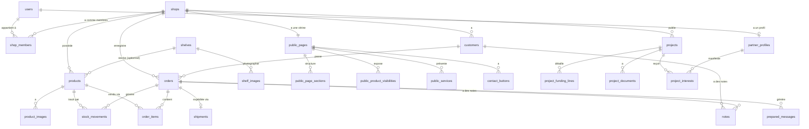

# Schéma de base de données — SaaS commerçants

> Modèle de données complet pour PostgreSQL. Ce document est la **référence canonique** pour toute création ou modification de table.
>
> Toute évolution du schéma doit passer par une mise à jour de ce document **et** par une migration Django.

---

## 1. Conventions générales

### Types

| Concept | Type PostgreSQL | Notes |
|---|---|---|
| Identifiant primaire | `UUID` | Généré par défaut (`gen_random_uuid()`). Évite les IDs séquentiels devinables. |
| Texte court | `VARCHAR(n)` | n explicite (ex. 120, 200) |
| Texte long | `TEXT` | description, notes, message, etc. |
| Argent | `DECIMAL(12, 2)` | **Jamais `float`**. Mappé sur `DecimalField` côté Django. |
| Quantité | `INTEGER` | Ou `DECIMAL(12, 3)` si on veut gérer les fractions (kg, mètres). À trancher. |
| Booléen | `BOOLEAN` | Toujours `NOT NULL` avec valeur par défaut. |
| Date + heure | `TIMESTAMPTZ` | Toujours avec fuseau horaire. |
| Date seule | `DATE` | Pour zakat, anniversaires, etc. |
| Enum | `VARCHAR + CHECK` | Plus simple que `CREATE TYPE`. Listé table par table. |
| Données flexibles | `JSONB` | Pour `settings_json`, métadonnées dynamiques. |
| URL fichier | `VARCHAR(500)` | Stocke `object_key` Object Storage, pas l'URL signée. |

### Champs présents sur quasi toutes les tables métier

```sql
id              UUID PRIMARY KEY DEFAULT gen_random_uuid()
shop_id         UUID NOT NULL REFERENCES shops(id) ON DELETE CASCADE  -- multi-tenant
created_at      TIMESTAMPTZ NOT NULL DEFAULT now()
updated_at      TIMESTAMPTZ NOT NULL DEFAULT now()
```

### Règles structurelles

- **Multi-tenant strict** : toute table métier porte `shop_id` (sauf `users`, `partner_profiles`, `subscription_plans`, `audit_logs`, `subscriptions`).
- **Soft delete** : on **ne supprime jamais** un produit, un client, un projet, ni une commande. On utilise `is_active = false` ou un statut `cancelled` / `archived`.
- **Stock** : la quantité d'un produit n'est **jamais réécrite** directement. Elle se déduit (et se cache) à partir de la somme des `stock_movements`.
- **Argent** : tous les montants sont dans la devise de la boutique (`shops.currency`). Pas de multi-devise par boutique en V1.
- **Index** : `shop_id` doit être indexé sur toutes les tables multi-tenant. Idéalement avec un index composite `(shop_id, created_at DESC)` pour les listes paginées.

---

## 2. Vue d'ensemble par domaines

```
DOMAINE                     TABLES
─────────────────────────────────────────────────────────────
Identité                    users, shops, shop_members
Catalogue                   products, product_images, shelves, shelf_images
Stock                       stock_movements
Clients                     customers
Commandes                   orders, order_items, shipments
Productivité                notes, reminders
Zakat                       zakat_calculations
OCR / IA                    uploaded_documents, ocr_results, detection_results
Communication               prepared_messages, telegram_accounts, telegram_publications
Page publique               public_pages, public_page_sections,
                            public_product_visibilities, public_services, contact_buttons
Projets halal               projects, project_funding_lines, project_documents,
                            partner_profiles, project_interests, project_reports
SaaS / Abonnement           subscription_plans, subscriptions
Audit                       audit_logs
```

---

## 3. Diagramme ER simplifié (Mermaid)



---

## 4. Domaine — Identité

### `users`

Compte utilisateur (commerçant ou partenaire potentiel).

| Champ | Type | Contraintes | Description |
|---|---|---|---|
| id | UUID | PK | Identifiant unique |
| email | VARCHAR(254) | UNIQUE, NOT NULL | Email de connexion |
| password_hash | VARCHAR(255) | NOT NULL | Géré par Django (PBKDF2 par défaut) |
| full_name | VARCHAR(150) | | Nom affiché |
| phone | VARCHAR(30) | | Téléphone optionnel |
| is_active | BOOLEAN | NOT NULL, DEFAULT true | Désactivation (RGPD) |
| email_verified_at | TIMESTAMPTZ | | Date validation email |
| last_login_at | TIMESTAMPTZ | | Dernière connexion |
| created_at | TIMESTAMPTZ | NOT NULL, DEFAULT now() | |
| updated_at | TIMESTAMPTZ | NOT NULL, DEFAULT now() | |

**Index** : `email` (UNIQUE).

---

### `shops`

Boutique (entité racine du multi-tenant).

| Champ | Type | Contraintes | Description |
|---|---|---|---|
| id | UUID | PK | |
| name | VARCHAR(120) | NOT NULL | Nom de la boutique |
| currency | VARCHAR(3) | NOT NULL, DEFAULT 'EUR' | Code ISO 4217 (EUR, MAD, DZD, XOF…) |
| country | VARCHAR(2) | | Code ISO 3166-1 alpha-2 |
| timezone | VARCHAR(50) | NOT NULL, DEFAULT 'Europe/Paris' | Pour le calcul "rappels du jour" |
| zakat_annual_date | DATE | | Date annuelle de zakat |
| logo_object_key | VARCHAR(500) | | Logo (Object Storage) |
| created_at | TIMESTAMPTZ | NOT NULL, DEFAULT now() | |
| updated_at | TIMESTAMPTZ | NOT NULL, DEFAULT now() | |

---

### `shop_members`

Lien entre `users` et `shops` (un utilisateur peut être membre de plusieurs boutiques, et plus tard une boutique peut avoir plusieurs membres).

| Champ | Type | Contraintes | Description |
|---|---|---|---|
| id | UUID | PK | |
| shop_id | UUID | FK → shops.id, NOT NULL | |
| user_id | UUID | FK → users.id, NOT NULL | |
| role | VARCHAR(20) | NOT NULL, DEFAULT 'owner' | `owner`, `manager`, `staff` |
| created_at | TIMESTAMPTZ | NOT NULL, DEFAULT now() | |

**Contrainte** : `UNIQUE (shop_id, user_id)`.

---

## 5. Domaine — Catalogue

### `products`

Produit du catalogue.

| Champ | Type | Contraintes | Description |
|---|---|---|---|
| id | UUID | PK | |
| shop_id | UUID | FK → shops.id, NOT NULL | |
| name | VARCHAR(200) | NOT NULL | |
| reference | VARCHAR(50) | | Référence interne (SKU) |
| description | TEXT | | |
| purchase_price | DECIMAL(12,2) | | Prix d'achat HT |
| selling_price | DECIMAL(12,2) | NOT NULL | Prix de vente |
| stock_quantity | INTEGER | NOT NULL, DEFAULT 0 | **Cache** dérivé des `stock_movements`. Ne pas modifier directement. |
| low_stock_threshold | INTEGER | | Seuil d'alerte |
| shelf_id | UUID | FK → shelves.id | Emplacement (optionnel) |
| qr_code_object_key | VARCHAR(500) | | QR code généré (V6) |
| is_active | BOOLEAN | NOT NULL, DEFAULT true | Soft delete (URS-011) |
| created_at | TIMESTAMPTZ | NOT NULL, DEFAULT now() | |
| updated_at | TIMESTAMPTZ | NOT NULL, DEFAULT now() | |

**Index** : `(shop_id, is_active)`, `(shop_id, name)` pour la recherche, `(shop_id, reference)`.

---

### `product_images`

Photos d'un produit (1..n).

| Champ | Type | Contraintes | Description |
|---|---|---|---|
| id | UUID | PK | |
| shop_id | UUID | FK → shops.id, NOT NULL | Redondant pour sécurité multi-tenant |
| product_id | UUID | FK → products.id, NOT NULL | |
| object_key | VARCHAR(500) | NOT NULL | Clé Object Storage |
| is_primary | BOOLEAN | NOT NULL, DEFAULT false | Photo principale |
| position | INTEGER | NOT NULL, DEFAULT 0 | Ordre |
| created_at | TIMESTAMPTZ | NOT NULL, DEFAULT now() | |

---

### `shelves`

Emplacement physique de stockage (V6 mais utile dès V1 si on veut).

| Champ | Type | Contraintes | Description |
|---|---|---|---|
| id | UUID | PK | |
| shop_id | UUID | FK → shops.id, NOT NULL | |
| name | VARCHAR(100) | NOT NULL | Ex: "Étagère A1", "Réserve gauche" |
| description | TEXT | | |
| created_at | TIMESTAMPTZ | NOT NULL, DEFAULT now() | |
| updated_at | TIMESTAMPTZ | NOT NULL, DEFAULT now() | |

---

### `shelf_images`

Photos d'une étagère (utilisées pour la détection visuelle V6).

| Champ | Type | Contraintes | Description |
|---|---|---|---|
| id | UUID | PK | |
| shop_id | UUID | FK → shops.id, NOT NULL | |
| shelf_id | UUID | FK → shelves.id, NOT NULL | |
| object_key | VARCHAR(500) | NOT NULL | |
| taken_at | TIMESTAMPTZ | NOT NULL, DEFAULT now() | |
| created_at | TIMESTAMPTZ | NOT NULL, DEFAULT now() | |

---

## 6. Domaine — Stock

### `stock_movements`

Source de vérité du stock. Chaque entrée, sortie, ajustement, ou réservation crée une ligne.

| Champ | Type | Contraintes | Description |
|---|---|---|---|
| id | UUID | PK | |
| shop_id | UUID | FK → shops.id, NOT NULL | |
| product_id | UUID | FK → products.id, NOT NULL | |
| movement_type | VARCHAR(20) | NOT NULL | `in`, `out`, `reservation`, `release`, `adjustment`, `loss` |
| quantity | INTEGER | NOT NULL | Toujours positif. Le `movement_type` indique le sens. |
| reason | TEXT | | Obligatoire pour `out`/`loss`/`adjustment` |
| order_id | UUID | FK → orders.id | Si lié à une commande |
| ocr_result_id | UUID | FK → ocr_results.id | Si créé via OCR (V6) |
| detection_result_id | UUID | FK → detection_results.id | Si créé via détection visuelle (V6) |
| created_by_user_id | UUID | FK → users.id | Auteur du mouvement |
| created_at | TIMESTAMPTZ | NOT NULL, DEFAULT now() | Date du mouvement |

**Index** : `(shop_id, product_id, created_at DESC)`.

**Règle de calcul** :
```
stock_quantity = SUM(quantity * sign(movement_type)) WHERE product_id = X
  où sign(in)=+, sign(release)=+, sign(out)=-, sign(reservation)=-, sign(loss)=-, sign(adjustment)=±
```

---

## 7. Domaine — Clients

### `customers`

| Champ | Type | Contraintes | Description |
|---|---|---|---|
| id | UUID | PK | |
| shop_id | UUID | FK → shops.id, NOT NULL | |
| name | VARCHAR(150) | NOT NULL | |
| phone | VARCHAR(30) | | |
| email | VARCHAR(254) | | |
| address_line | VARCHAR(255) | | |
| city | VARCHAR(100) | | |
| postal_code | VARCHAR(20) | | |
| country | VARCHAR(2) | | Code ISO |
| notes | TEXT | | Texte libre |
| is_active | BOOLEAN | NOT NULL, DEFAULT true | |
| created_at | TIMESTAMPTZ | NOT NULL, DEFAULT now() | |
| updated_at | TIMESTAMPTZ | NOT NULL, DEFAULT now() | |

**Index** : `(shop_id, name)`, `(shop_id, phone)`.

---

## 8. Domaine — Commandes

### `orders`

| Champ | Type | Contraintes | Description |
|---|---|---|---|
| id | UUID | PK | |
| shop_id | UUID | FK → shops.id, NOT NULL | |
| customer_id | UUID | FK → customers.id | NULL = vente rapide sans client (URS-023) |
| order_number | VARCHAR(20) | NOT NULL | Numéro lisible (ex: `2025-001`). UNIQUE par boutique. |
| status | VARCHAR(20) | NOT NULL, DEFAULT 'draft' | `draft`, `to_prepare`, `prepared`, `shipped`, `cancelled` |
| payment_status | VARCHAR(20) | NOT NULL, DEFAULT 'unpaid' | `unpaid`, `partial`, `paid` |
| subtotal | DECIMAL(12,2) | NOT NULL, DEFAULT 0 | Somme des lignes |
| discount_amount | DECIMAL(12,2) | NOT NULL, DEFAULT 0 | Remise globale |
| shipping_amount | DECIMAL(12,2) | NOT NULL, DEFAULT 0 | Frais de livraison |
| total_amount | DECIMAL(12,2) | NOT NULL, DEFAULT 0 | `subtotal − discount + shipping` |
| amount_paid | DECIMAL(12,2) | NOT NULL, DEFAULT 0 | Acompte ou paiement total |
| notes | TEXT | | Note libre sur la commande |
| created_at | TIMESTAMPTZ | NOT NULL, DEFAULT now() | |
| updated_at | TIMESTAMPTZ | NOT NULL, DEFAULT now() | |
| cancelled_at | TIMESTAMPTZ | | |

**Contrainte** : `UNIQUE (shop_id, order_number)`.
**Index** : `(shop_id, status)`, `(shop_id, payment_status)`, `(shop_id, created_at DESC)`.

---

### `order_items`

Lignes d'une commande.

| Champ | Type | Contraintes | Description |
|---|---|---|---|
| id | UUID | PK | |
| shop_id | UUID | FK → shops.id, NOT NULL | Redondant pour sécurité |
| order_id | UUID | FK → orders.id, NOT NULL | |
| product_id | UUID | FK → products.id | NULL si produit ad-hoc |
| product_name | VARCHAR(200) | NOT NULL | Snapshot au moment de la vente |
| unit_price | DECIMAL(12,2) | NOT NULL | Snapshot |
| quantity | INTEGER | NOT NULL | |
| line_total | DECIMAL(12,2) | NOT NULL | `unit_price * quantity` |
| created_at | TIMESTAMPTZ | NOT NULL, DEFAULT now() | |

**Index** : `(order_id)`.

---

### `shipments`

Informations d'expédition d'une commande (1-1 avec `orders`).

| Champ | Type | Contraintes | Description |
|---|---|---|---|
| id | UUID | PK | |
| shop_id | UUID | FK → shops.id, NOT NULL | |
| order_id | UUID | FK → orders.id, NOT NULL, UNIQUE | |
| recipient_name | VARCHAR(150) | NOT NULL | |
| recipient_phone | VARCHAR(30) | | |
| address_line | VARCHAR(255) | | |
| city | VARCHAR(100) | | |
| postal_code | VARCHAR(20) | | |
| country | VARCHAR(2) | | |
| delivery_method | VARCHAR(50) | | `pickup`, `local_delivery`, `post`, `private_carrier` |
| carrier | VARCHAR(100) | | Nom du transporteur |
| tracking_number | VARCHAR(100) | | |
| delivery_note | TEXT | | |
| label_pdf_object_key | VARCHAR(500) | | Fiche colis générée (URS-029) |
| shipped_at | TIMESTAMPTZ | | |
| delivered_at | TIMESTAMPTZ | | |
| created_at | TIMESTAMPTZ | NOT NULL, DEFAULT now() | |
| updated_at | TIMESTAMPTZ | NOT NULL, DEFAULT now() | |

---

## 9. Domaine — Productivité

### `notes`

Note libre, ou liée à un client, ou liée à une commande.

| Champ | Type | Contraintes | Description |
|---|---|---|---|
| id | UUID | PK | |
| shop_id | UUID | FK → shops.id, NOT NULL | |
| author_user_id | UUID | FK → users.id | |
| customer_id | UUID | FK → customers.id | NULL si pas liée à un client |
| order_id | UUID | FK → orders.id | NULL si pas liée à une commande |
| content | TEXT | NOT NULL | |
| created_at | TIMESTAMPTZ | NOT NULL, DEFAULT now() | |
| updated_at | TIMESTAMPTZ | NOT NULL, DEFAULT now() | |

---

### `reminders`

| Champ | Type | Contraintes | Description |
|---|---|---|---|
| id | UUID | PK | |
| shop_id | UUID | FK → shops.id, NOT NULL | |
| author_user_id | UUID | FK → users.id | |
| title | VARCHAR(200) | NOT NULL | |
| description | TEXT | | |
| due_at | TIMESTAMPTZ | NOT NULL | Date d'échéance |
| category | VARCHAR(30) | | `unpaid`, `customer_followup`, `zakat`, `order_prep`, `free` |
| customer_id | UUID | FK → customers.id | Optionnel |
| order_id | UUID | FK → orders.id | Optionnel |
| status | VARCHAR(20) | NOT NULL, DEFAULT 'pending' | `pending`, `done`, `dismissed` |
| done_at | TIMESTAMPTZ | | |
| created_at | TIMESTAMPTZ | NOT NULL, DEFAULT now() | |
| updated_at | TIMESTAMPTZ | NOT NULL, DEFAULT now() | |

**Index** : `(shop_id, status, due_at)`.

---

## 10. Domaine — Zakat

### `zakat_calculations`

Calcul de zakat sauvegardé pour un exercice.

| Champ | Type | Contraintes | Description |
|---|---|---|---|
| id | UUID | PK | |
| shop_id | UUID | FK → shops.id, NOT NULL | |
| reference_date | DATE | NOT NULL | Date de référence du calcul (date de zakat de l'année) |
| stock_value_estimated | DECIMAL(12,2) | NOT NULL, DEFAULT 0 | Valeur calculée (somme produits actifs × prix d'achat) |
| stock_value_adjusted | DECIMAL(12,2) | | Valeur corrigée manuellement (URS-037) |
| cash_amount | DECIMAL(12,2) | NOT NULL, DEFAULT 0 | Liquidités (URS-038) |
| receivables_amount | DECIMAL(12,2) | NOT NULL, DEFAULT 0 | Créances clients (URS-039) |
| short_term_debts | DECIMAL(12,2) | NOT NULL, DEFAULT 0 | Dettes court terme (URS-040) |
| zakat_base | DECIMAL(12,2) | NOT NULL | `stock_adjusted + cash + receivables − debts` |
| zakat_rate | DECIMAL(5,4) | NOT NULL, DEFAULT 0.0250 | 2,5 % par défaut |
| zakat_amount | DECIMAL(12,2) | NOT NULL | `zakat_base * zakat_rate` |
| currency | VARCHAR(3) | NOT NULL | Devise au moment du calcul |
| pdf_object_key | VARCHAR(500) | | Export PDF généré (URS-060) |
| notes | TEXT | | |
| created_at | TIMESTAMPTZ | NOT NULL, DEFAULT now() | |
| updated_at | TIMESTAMPTZ | NOT NULL, DEFAULT now() | |

**Règle d'affichage** : toujours afficher la mention « estimation indicative ».

---

## 11. Domaine — OCR / IA (V6)

### `uploaded_documents`

Document brut envoyé par le commerçant (facture, capture d'adresse, etc.).

| Champ | Type | Contraintes | Description |
|---|---|---|---|
| id | UUID | PK | |
| shop_id | UUID | FK → shops.id, NOT NULL | |
| uploaded_by_user_id | UUID | FK → users.id | |
| document_type | VARCHAR(30) | NOT NULL | `supplier_invoice`, `customer_address`, `other` |
| object_key | VARCHAR(500) | NOT NULL | Fichier dans Object Storage privé |
| original_filename | VARCHAR(255) | | |
| mime_type | VARCHAR(100) | | |
| size_bytes | BIGINT | | |
| created_at | TIMESTAMPTZ | NOT NULL, DEFAULT now() | |

---

### `ocr_results`

Résultat d'OCR sur un document.

| Champ | Type | Contraintes | Description |
|---|---|---|---|
| id | UUID | PK | |
| shop_id | UUID | FK → shops.id, NOT NULL | |
| uploaded_document_id | UUID | FK → uploaded_documents.id, NOT NULL | |
| status | VARCHAR(20) | NOT NULL, DEFAULT 'pending' | `pending`, `processing`, `done`, `failed`, `validated` |
| raw_text | TEXT | | Texte brut extrait |
| structured_data | JSONB | | Données structurées (lignes, montants, adresse) |
| confidence_score | DECIMAL(4,3) | | 0.000 à 1.000 |
| validated_by_user_id | UUID | FK → users.id | |
| validated_at | TIMESTAMPTZ | | |
| error_message | TEXT | | |
| created_at | TIMESTAMPTZ | NOT NULL, DEFAULT now() | |
| updated_at | TIMESTAMPTZ | NOT NULL, DEFAULT now() | |

---

### `detection_results`

Résultat de détection visuelle sur une photo d'étagère.

| Champ | Type | Contraintes | Description |
|---|---|---|---|
| id | UUID | PK | |
| shop_id | UUID | FK → shops.id, NOT NULL | |
| shelf_image_id | UUID | FK → shelf_images.id, NOT NULL | |
| status | VARCHAR(20) | NOT NULL, DEFAULT 'pending' | `pending`, `processing`, `done`, `failed`, `validated` |
| detected_items | JSONB | | `[{product_id?, label, count, confidence, bbox}]` |
| validated_by_user_id | UUID | FK → users.id | |
| validated_at | TIMESTAMPTZ | | |
| created_at | TIMESTAMPTZ | NOT NULL, DEFAULT now() | |
| updated_at | TIMESTAMPTZ | NOT NULL, DEFAULT now() | |

---

## 12. Domaine — Communication

### `prepared_messages`

Messages WhatsApp préparés (jamais envoyés automatiquement).

| Champ | Type | Contraintes | Description |
|---|---|---|---|
| id | UUID | PK | |
| shop_id | UUID | FK → shops.id, NOT NULL | |
| template_type | VARCHAR(30) | NOT NULL | `order_confirmation`, `tracking`, `unpaid_followup`, `promo`, `free` |
| context_type | VARCHAR(30) | | `order`, `customer`, `product`, `none` |
| context_id | UUID | | ID polymorphique selon `context_type` |
| customer_id | UUID | FK → customers.id | Pour faciliter les requêtes |
| recipient_name | VARCHAR(150) | | |
| recipient_phone | VARCHAR(30) | | |
| message | TEXT | NOT NULL | Contenu final |
| status | VARCHAR(20) | NOT NULL, DEFAULT 'prepared' | `prepared`, `sent_manually`, `archived` |
| sent_manually_at | TIMESTAMPTZ | | Renseigné manuellement par l'utilisateur |
| created_at | TIMESTAMPTZ | NOT NULL, DEFAULT now() | |
| updated_at | TIMESTAMPTZ | NOT NULL, DEFAULT now() | |

---

### `telegram_accounts`

Configuration du bot Telegram d'une boutique.

| Champ | Type | Contraintes | Description |
|---|---|---|---|
| id | UUID | PK | |
| shop_id | UUID | FK → shops.id, NOT NULL, UNIQUE | Un seul bot par boutique |
| bot_token_encrypted | TEXT | NOT NULL | **Chiffré côté Django (django-encrypted-fields ou équivalent)** |
| destination_type | VARCHAR(20) | | `channel`, `group` |
| destination_chat_id | VARCHAR(50) | | ID Telegram |
| destination_label | VARCHAR(100) | | Nom affiché |
| permissions_verified_at | TIMESTAMPTZ | | Dernière vérification des droits |
| is_active | BOOLEAN | NOT NULL, DEFAULT true | |
| created_at | TIMESTAMPTZ | NOT NULL, DEFAULT now() | |
| updated_at | TIMESTAMPTZ | NOT NULL, DEFAULT now() | |

---

### `telegram_publications`

| Champ | Type | Contraintes | Description |
|---|---|---|---|
| id | UUID | PK | |
| shop_id | UUID | FK → shops.id, NOT NULL | |
| telegram_account_id | UUID | FK → telegram_accounts.id, NOT NULL | |
| message | TEXT | NOT NULL | |
| media_object_key | VARCHAR(500) | | Image attachée |
| scheduled_at | TIMESTAMPTZ | | Date de publication |
| frequency | VARCHAR(20) | | `once`, `daily`, `weekly`, `monthly` |
| status | VARCHAR(20) | NOT NULL, DEFAULT 'scheduled' | `scheduled`, `sent`, `failed`, `cancelled` |
| last_run_at | TIMESTAMPTZ | | |
| error_message | TEXT | | |
| created_at | TIMESTAMPTZ | NOT NULL, DEFAULT now() | |
| updated_at | TIMESTAMPTZ | NOT NULL, DEFAULT now() | |

---

## 13. Domaine — Page publique

### `public_pages`

| Champ | Type | Contraintes | Description |
|---|---|---|---|
| id | UUID | PK | |
| shop_id | UUID | FK → shops.id, NOT NULL, UNIQUE | Une page par boutique |
| slug | VARCHAR(80) | NOT NULL, UNIQUE | URL: `/boutique/{slug}` |
| is_active | BOOLEAN | NOT NULL, DEFAULT false | |
| title | VARCHAR(150) | | |
| subtitle | VARCHAR(200) | | |
| description | TEXT | | |
| logo_object_key | VARCHAR(500) | | |
| cover_image_object_key | VARCHAR(500) | | |
| theme_id | VARCHAR(50) | NOT NULL, DEFAULT 'default' | Identifiant de thème |
| primary_color | VARCHAR(7) | | Hex ex: `#00AA88` |
| secondary_color | VARCHAR(7) | | |
| draft_data | JSONB | | Brouillon avant publication |
| published_at | TIMESTAMPTZ | | |
| created_at | TIMESTAMPTZ | NOT NULL, DEFAULT now() | |
| updated_at | TIMESTAMPTZ | NOT NULL, DEFAULT now() | |

---

### `public_page_sections`

| Champ | Type | Contraintes | Description |
|---|---|---|---|
| id | UUID | PK | |
| page_id | UUID | FK → public_pages.id, NOT NULL | |
| type | VARCHAR(30) | NOT NULL | `hero`, `description`, `products`, `services`, `contact`, `gallery`, `testimonials` |
| title | VARCHAR(150) | | |
| content | TEXT | | |
| position | INTEGER | NOT NULL, DEFAULT 0 | |
| is_visible | BOOLEAN | NOT NULL, DEFAULT true | |
| settings_json | JSONB | | Réglages spécifiques au type |
| created_at | TIMESTAMPTZ | NOT NULL, DEFAULT now() | |
| updated_at | TIMESTAMPTZ | NOT NULL, DEFAULT now() | |

---

### `public_product_visibilities`

Sélection et personnalisation des produits visibles sur la page publique.

| Champ | Type | Contraintes | Description |
|---|---|---|---|
| id | UUID | PK | |
| page_id | UUID | FK → public_pages.id, NOT NULL | |
| product_id | UUID | FK → products.id, NOT NULL | |
| is_visible | BOOLEAN | NOT NULL, DEFAULT true | |
| custom_title | VARCHAR(200) | | Surcharge optionnelle |
| custom_description | TEXT | | |
| custom_price | DECIMAL(12,2) | | |
| badge | VARCHAR(20) | | `new`, `promo`, `out_of_stock`, `limited` |
| position | INTEGER | NOT NULL, DEFAULT 0 | |
| created_at | TIMESTAMPTZ | NOT NULL, DEFAULT now() | |
| updated_at | TIMESTAMPTZ | NOT NULL, DEFAULT now() | |

**Contrainte** : `UNIQUE (page_id, product_id)`.

---

### `public_services`

Services proposés (pour les commerçants qui vendent du service).

| Champ | Type | Contraintes | Description |
|---|---|---|---|
| id | UUID | PK | |
| page_id | UUID | FK → public_pages.id, NOT NULL | |
| title | VARCHAR(150) | NOT NULL | |
| description | TEXT | | |
| price_label | VARCHAR(50) | | Ex: `120 €`, `Sur devis` |
| image_object_key | VARCHAR(500) | | |
| is_visible | BOOLEAN | NOT NULL, DEFAULT true | |
| position | INTEGER | NOT NULL, DEFAULT 0 | |
| created_at | TIMESTAMPTZ | NOT NULL, DEFAULT now() | |
| updated_at | TIMESTAMPTZ | NOT NULL, DEFAULT now() | |

---

### `contact_buttons`

| Champ | Type | Contraintes | Description |
|---|---|---|---|
| id | UUID | PK | |
| page_id | UUID | FK → public_pages.id, NOT NULL | |
| type | VARCHAR(20) | NOT NULL | `whatsapp`, `telegram`, `instagram`, `phone`, `email`, `link` |
| label | VARCHAR(50) | | Texte du bouton |
| url | VARCHAR(500) | | Pour `link`, `instagram`, `telegram` |
| phone_number | VARCHAR(30) | | Pour `whatsapp`, `phone` |
| message_template | TEXT | | Pré-rempli pour WhatsApp |
| is_primary | BOOLEAN | NOT NULL, DEFAULT false | |
| position | INTEGER | NOT NULL, DEFAULT 0 | |
| created_at | TIMESTAMPTZ | NOT NULL, DEFAULT now() | |
| updated_at | TIMESTAMPTZ | NOT NULL, DEFAULT now() | |

---

## 14. Domaine — Projets et partenariats halal

### `projects`

| Champ | Type | Contraintes | Description |
|---|---|---|---|
| id | UUID | PK | |
| shop_id | UUID | FK → shops.id | NULLABLE (un projet peut être hors boutique) |
| owner_user_id | UUID | FK → users.id, NOT NULL | |
| title | VARCHAR(200) | NOT NULL | |
| slug | VARCHAR(120) | NOT NULL, UNIQUE | URL `/projets/{slug}` |
| sector | VARCHAR(50) | | Secteur d'activité |
| city | VARCHAR(100) | | |
| country | VARCHAR(2) | | |
| description | TEXT | NOT NULL | |
| project_stage | VARCHAR(30) | NOT NULL | `idea`, `testing`, `launched`, `growing` |
| need_type | VARCHAR(30) | NOT NULL | `partner`, `associate`, `funding`, `skill`, `mentor` |
| indicative_amount | DECIMAL(12,2) | | Montant indicatif (jamais une collecte) |
| currency | VARCHAR(3) | | |
| funding_use_description | TEXT | | Usage prévu du montant |
| partnership_type | VARCHAR(50) | NOT NULL | `commercial`, `association`, `profit_loss_sharing`, `funding_with_involvement`, `other` |
| status | VARCHAR(20) | NOT NULL, DEFAULT 'draft' | `draft`, `published`, `paused`, `closed`, `suspended` |
| visibility | VARCHAR(20) | NOT NULL, DEFAULT 'public' | `public`, `private`, `on_request` |
| created_at | TIMESTAMPTZ | NOT NULL, DEFAULT now() | |
| updated_at | TIMESTAMPTZ | NOT NULL, DEFAULT now() | |

**Règle métier** : `indicative_amount` est toujours présenté côté UI comme « montant indicatif », jamais comme « objectif de collecte ».

---

### `project_funding_lines`

Détail facultatif de l'usage du montant indicatif.

| Champ | Type | Contraintes | Description |
|---|---|---|---|
| id | UUID | PK | |
| project_id | UUID | FK → projects.id, NOT NULL | |
| label | VARCHAR(150) | NOT NULL | Ex: "Achat machine" |
| amount | DECIMAL(12,2) | NOT NULL | |
| description | TEXT | | |
| created_at | TIMESTAMPTZ | NOT NULL, DEFAULT now() | |

---

### `project_documents`

| Champ | Type | Contraintes | Description |
|---|---|---|---|
| id | UUID | PK | |
| project_id | UUID | FK → projects.id, NOT NULL | |
| object_key | VARCHAR(500) | NOT NULL | |
| title | VARCHAR(150) | | |
| visibility | VARCHAR(20) | NOT NULL, DEFAULT 'private' | `public`, `private`, `on_request` |
| created_at | TIMESTAMPTZ | NOT NULL, DEFAULT now() | |

---

### `partner_profiles`

Profil de personne intéressée pour devenir partenaire.

| Champ | Type | Contraintes | Description |
|---|---|---|---|
| id | UUID | PK | |
| user_id | UUID | FK → users.id, NOT NULL, UNIQUE | Un profil par user |
| budget_min | DECIMAL(12,2) | | Enveloppe indicative min |
| budget_max | DECIMAL(12,2) | | Enveloppe indicative max |
| currency | VARCHAR(3) | | |
| preferred_sectors | TEXT[] | | Tableau PostgreSQL ou JSONB |
| preferred_countries | TEXT[] | | |
| skills | TEXT[] | | |
| involvement_type | VARCHAR(20) | | `active`, `passive`, `mixed` |
| description | TEXT | | |
| created_at | TIMESTAMPTZ | NOT NULL, DEFAULT now() | |
| updated_at | TIMESTAMPTZ | NOT NULL, DEFAULT now() | |

---

### `project_interests`

Manifestation d'intérêt d'un partenaire pour un projet.

| Champ | Type | Contraintes | Description |
|---|---|---|---|
| id | UUID | PK | |
| project_id | UUID | FK → projects.id, NOT NULL | |
| partner_profile_id | UUID | FK → partner_profiles.id, NOT NULL | |
| message | TEXT | NOT NULL | |
| indicative_amount | DECIMAL(12,2) | | |
| status | VARCHAR(20) | NOT NULL, DEFAULT 'pending' | `pending`, `accepted`, `refused`, `archived` |
| handled_at | TIMESTAMPTZ | | |
| created_at | TIMESTAMPTZ | NOT NULL, DEFAULT now() | |
| updated_at | TIMESTAMPTZ | NOT NULL, DEFAULT now() | |

**Contrainte** : `UNIQUE (project_id, partner_profile_id)` (une seule manifestation par couple).

---

### `project_reports`

Signalements d'un projet ou d'un profil.

| Champ | Type | Contraintes | Description |
|---|---|---|---|
| id | UUID | PK | |
| project_id | UUID | FK → projects.id | NULL si on signale un profil |
| reported_user_id | UUID | FK → users.id | NULL si on signale un projet |
| reporter_user_id | UUID | FK → users.id, NOT NULL | |
| reason | VARCHAR(50) | NOT NULL | `scam`, `interest_loan`, `inappropriate`, `false_info`, `other` |
| description | TEXT | | |
| status | VARCHAR(20) | NOT NULL, DEFAULT 'pending' | `pending`, `reviewed`, `dismissed`, `actioned` |
| reviewed_at | TIMESTAMPTZ | | |
| created_at | TIMESTAMPTZ | NOT NULL, DEFAULT now() | |

**Contrainte** : `CHECK (project_id IS NOT NULL OR reported_user_id IS NOT NULL)`.

---

## 15. Domaine — Abonnement SaaS

### `subscription_plans`

Plans tarifaires (gérés par l'admin de la plateforme, pas par les commerçants).

| Champ | Type | Contraintes | Description |
|---|---|---|---|
| id | UUID | PK | |
| code | VARCHAR(50) | NOT NULL, UNIQUE | Ex: `free`, `pro_monthly`, `pro_yearly` |
| name | VARCHAR(100) | NOT NULL | |
| description | TEXT | | |
| price_amount | DECIMAL(12,2) | NOT NULL, DEFAULT 0 | 0 pour gratuit |
| currency | VARCHAR(3) | NOT NULL, DEFAULT 'EUR' | |
| billing_period | VARCHAR(20) | | `month`, `year`, `lifetime` |
| stripe_price_id | VARCHAR(100) | | ID Stripe |
| max_products | INTEGER | | NULL = illimité |
| max_orders_per_month | INTEGER | | NULL = illimité |
| features_json | JSONB | | Liste fonctionnalités incluses |
| is_active | BOOLEAN | NOT NULL, DEFAULT true | |
| created_at | TIMESTAMPTZ | NOT NULL, DEFAULT now() | |
| updated_at | TIMESTAMPTZ | NOT NULL, DEFAULT now() | |

---

### `subscriptions`

Abonnement d'une boutique à un plan.

| Champ | Type | Contraintes | Description |
|---|---|---|---|
| id | UUID | PK | |
| shop_id | UUID | FK → shops.id, NOT NULL, UNIQUE | Un abonnement actif par boutique |
| plan_id | UUID | FK → subscription_plans.id, NOT NULL | |
| status | VARCHAR(20) | NOT NULL, DEFAULT 'active' | `trialing`, `active`, `past_due`, `cancelled`, `paused` |
| stripe_subscription_id | VARCHAR(100) | | |
| stripe_customer_id | VARCHAR(100) | | |
| current_period_start | TIMESTAMPTZ | | |
| current_period_end | TIMESTAMPTZ | | |
| cancel_at_period_end | BOOLEAN | NOT NULL, DEFAULT false | |
| cancelled_at | TIMESTAMPTZ | | |
| created_at | TIMESTAMPTZ | NOT NULL, DEFAULT now() | |
| updated_at | TIMESTAMPTZ | NOT NULL, DEFAULT now() | |

---

## 16. Domaine — Audit

### `audit_logs`

Journalisation des actions sensibles (URS-062 + fiche technique §14.4).

| Champ | Type | Contraintes | Description |
|---|---|---|---|
| id | UUID | PK | |
| shop_id | UUID | FK → shops.id | NULL si action plateforme |
| user_id | UUID | FK → users.id | Auteur |
| action | VARCHAR(50) | NOT NULL | `stock.update`, `product.deactivate`, `order.status_change`, `data.export`, `document.access`, `telegram.publish`, `public_page.update`, `project.report`, `subscription.change` |
| target_type | VARCHAR(50) | | `Product`, `Order`, etc. |
| target_id | UUID | | |
| metadata | JSONB | | Détails (ancienne valeur / nouvelle valeur) |
| ip_address | INET | | |
| user_agent | VARCHAR(255) | | |
| created_at | TIMESTAMPTZ | NOT NULL, DEFAULT now() | |

**Index** : `(shop_id, created_at DESC)`, `(user_id, created_at DESC)`, `(action, created_at DESC)`.

---

## 17. Index et performances recommandés

À créer dès la première migration :

```sql
-- Multi-tenant isolation (toutes les tables)
CREATE INDEX idx_products_shop ON products(shop_id, is_active);
CREATE INDEX idx_orders_shop_status ON orders(shop_id, status);
CREATE INDEX idx_orders_shop_payment ON orders(shop_id, payment_status);
CREATE INDEX idx_orders_shop_created ON orders(shop_id, created_at DESC);
CREATE INDEX idx_customers_shop_name ON customers(shop_id, name);
CREATE INDEX idx_stock_movements_product ON stock_movements(shop_id, product_id, created_at DESC);
CREATE INDEX idx_reminders_shop_due ON reminders(shop_id, status, due_at);
CREATE INDEX idx_audit_logs_shop ON audit_logs(shop_id, created_at DESC);

-- Recherche
CREATE INDEX idx_products_search ON products USING gin(to_tsvector('simple', name));

-- Unicité fonctionnelle
CREATE UNIQUE INDEX uq_orders_number ON orders(shop_id, order_number);
CREATE UNIQUE INDEX uq_public_pages_slug ON public_pages(slug);
CREATE UNIQUE INDEX uq_projects_slug ON projects(slug);
```

---

## 18. Row Level Security (optionnel, défense supplémentaire)

À envisager une fois l'application stabilisée. Exemple sur `products` :

```sql
ALTER TABLE products ENABLE ROW LEVEL SECURITY;

CREATE POLICY products_shop_isolation ON products
    USING (shop_id = current_setting('app.current_shop_id')::UUID);
```

Le backend Django définirait `SET LOCAL app.current_shop_id = '...'` au début de chaque requête. **Ne remplace pas** les filtres applicatifs : c'est une **deuxième barrière**.

---

## 19. Évolutions probables (non bloquant pour la V1)

- **Multi-devise par boutique** : ajouter une table `exchange_rates` et `currency` sur `orders`.
- **Variantes produit** (taille, couleur) : table `product_variants` avec ses propres `stock_movements`.
- **Plusieurs membres par boutique** : déjà couvert par `shop_members`, mais il faudra ajouter une UI d'invitation.
- **Notifications push** : table `push_devices` (token APNs / FCM).
- **Avis clients** sur la page publique : table `public_reviews`.

---

## 20. Checklist sécurité du schéma

- [ ] Toutes les tables métier ont `shop_id NOT NULL` (sauf `users`, `partner_profiles`, `subscription_plans`, `audit_logs`, `subscriptions`).
- [ ] Toutes les FK vers `shops` sont en `ON DELETE CASCADE`.
- [ ] Toutes les FK vers `users` sont en `ON DELETE SET NULL` (RGPD : on peut supprimer un user sans détruire l'historique de la boutique).
- [ ] Tous les champs `*_object_key` pointent vers le bucket privé par défaut.
- [ ] Aucun champ ne stocke un mot de passe en clair, un token Stripe en clair, ou un bot token Telegram en clair.
- [ ] Tous les `enum-like` ont une contrainte `CHECK` ou un type ENUM PostgreSQL.
- [ ] Tous les `created_at` / `updated_at` sont en `TIMESTAMPTZ`.
- [ ] Index sur `shop_id` partout pour éviter les full scans en multi-tenant.
