# Schéma de base de données — SaaS commerçants

> Modèle de données complet pour PostgreSQL. Ce document est la **référence canonique** pour toute création ou modification de table.
>
> Toute évolution du schéma doit passer par une mise à jour de ce document **et** par une migration Django.

---

## 1. Conventions générales

### Types

| Concept | Type PostgreSQL | Notes |
|---|---|---|
| Identifiant primaire | `UUID` | Généré par défaut (`gen_random_uuid()`). Évite les IDs séquentiels devinables. |
| Texte court | `VARCHAR(n)` | n explicite (ex. 120, 200) |
| Texte long | `TEXT` | description, notes, message, etc. |
| Argent | `DECIMAL(12, 2)` | **Jamais `float`**. Mappé sur `DecimalField` côté Django. |
| Quantité | `INTEGER` | Ou `DECIMAL(12, 3)` si on veut gérer les fractions (kg, mètres). À trancher. |
| Booléen | `BOOLEAN` | Toujours `NOT NULL` avec valeur par défaut. |
| Date + heure | `TIMESTAMPTZ` | Toujours avec fuseau horaire. |
| Date seule | `DATE` | Pour zakat, anniversaires, etc. |
| Enum | `VARCHAR + CHECK` | Plus simple que `CREATE TYPE`. Listé table par table. |
| Données flexibles | `JSONB` | Pour `settings_json`, métadonnées dynamiques. |
| URL fichier | `VARCHAR(500)` | Stocke `object_key` Object Storage, pas l'URL signée. |

### Champs présents sur quasi toutes les tables métier

```sql
id              UUID PRIMARY KEY DEFAULT gen_random_uuid()
shop_id         UUID NOT NULL REFERENCES shops(id) ON DELETE CASCADE  -- multi-tenant
created_at      TIMESTAMPTZ NOT NULL DEFAULT now()
updated_at      TIMESTAMPTZ NOT NULL DEFAULT now()
```

### Règles structurelles

- **Multi-tenant strict** : toute table métier porte `shop_id` (sauf `users`, `partner_profiles`, `subscription_plans`, `audit_logs`, `subscriptions`).
- **Soft delete** : on **ne supprime jamais** un produit, un client, un projet, ni une commande. On utilise `is_active = false` ou un statut `cancelled` / `archived`.
- **Stock** : le stock est porté par la **variante** (`product_variants`), pas par le produit. La quantité d'une variante n'est **jamais réécrite** directement : elle se déduit (et se cache dans `product_variants.stock_quantity`) à partir de la somme des `stock_movements` de cette variante.
- **Argent** : tous les montants sont dans la devise de la boutique (`shops.currency`). Pas de multi-devise par boutique en V1.
- **Facturation** : une facture émise est **immuable** (montants, numéro, snapshots). Seul le `status` peut évoluer (`issued` → `paid`/`cancelled`). Contrainte légale ; toute correction se ferait par avoir (non couvert V1).
- **Index** : `shop_id` doit être indexé sur toutes les tables multi-tenant. Idéalement avec un index composite `(shop_id, created_at DESC)` pour les listes paginées.

---

## 2. Vue d'ensemble par domaines

```
DOMAINE                     TABLES
─────────────────────────────────────────────────────────────
Identité                    users, shops, shop_members
Catalogue                   products, product_variants, product_images,
                            shelves, shelf_images
Stock                       stock_movements
Clients                     customers
Commandes                   orders, order_items, shipments
Facturation                 invoices, invoice_lines, invoice_sequences
Productivité                notes, reminders
Zakat                       zakat_calculations
OCR / IA                    uploaded_documents, ocr_results, detection_results
Communication               prepared_messages, telegram_accounts, telegram_publications
Page publique               public_pages, public_page_sections,
                            public_product_visibilities, public_services, contact_buttons
Projets halal               projects, project_funding_lines, project_documents,
                            partner_profiles, project_interests, project_reports
SaaS / Abonnement           subscription_plans, subscriptions
Audit                       audit_logs
```

---

## 3. Diagramme ER simplifié (Mermaid)

```mermaid
erDiagram
    users ||--o{ shop_members : "appartient à"
    shops ||--o{ shop_members : "a comme membres"
    shops ||--o{ products : "possède"
    shops ||--o{ product_variants : "possède"
    shops ||--o{ customers : "a"
    shops ||--o{ orders : "enregistre"
    shops ||--o{ invoices : "émet"
    shops ||--|| invoice_sequences : "compteur factures"
    shops ||--|| public_pages : "a une vitrine"

    products ||--o{ product_variants : "décliné en"
    products ||--o{ product_images : "a"
    product_variants ||--o{ stock_movements : "tracé par"
    product_variants ||--o{ order_items : "vendu via"
    shelves ||--o{ shelf_images : "photographié"

    customers ||--o{ orders : "passe"
    customers ||--o{ invoices : "facturée à"
    customers ||--o{ notes : "a des notes"

    orders ||--o{ order_items : "contient"
    orders ||--o| shipments : "expédiée via"
    orders ||--o| invoice : "facturée par"
    orders ||--o{ stock_movements : "génère"
    orders ||--o{ notes : "a des notes"
    orders ||--o{ prepared_messages : "génère"

    invoices ||--o{ invoice_lines : "détaille"

    public_pages ||--o{ public_page_sections : "structure"
    public_pages ||--o{ public_product_visibilities : "expose"
    public_pages ||--o{ public_services : "présente"
    public_pages ||--o{ contact_buttons : "a"

    shops ||--o{ projects : "publie"
    users ||--o| partner_profiles : "a un profil"
    projects ||--o{ project_funding_lines : "détaille"
    projects ||--o{ project_documents : "a"
    projects ||--o{ project_interests : "reçoit"
    partner_profiles ||--o{ project_interests : "manifeste"
```



---

## 4. Domaine — Identité

### `users`

Compte utilisateur (commerçant ou partenaire potentiel).

| Champ | Type | Contraintes | Description |
|---|---|---|---|
| id | UUID | PK | Identifiant unique |
| email | VARCHAR(254) | UNIQUE, NOT NULL | Email de connexion |
| password_hash | VARCHAR(255) | NOT NULL | Géré par Django (PBKDF2 par défaut) |
| full_name | VARCHAR(150) | | Nom affiché |
| phone | VARCHAR(30) | | Téléphone optionnel |
| is_active | BOOLEAN | NOT NULL, DEFAULT true | Désactivation (RGPD) |
| email_verified_at | TIMESTAMPTZ | | Date validation email |
| last_login_at | TIMESTAMPTZ | | Dernière connexion |
| created_at | TIMESTAMPTZ | NOT NULL, DEFAULT now() | |
| updated_at | TIMESTAMPTZ | NOT NULL, DEFAULT now() | |

**Index** : `email` (UNIQUE).

---

### `shops`

Boutique (entité racine du multi-tenant).

| Champ | Type | Contraintes | Description |
|---|---|---|---|
| id | UUID | PK | |
| name | VARCHAR(120) | NOT NULL | Nom de la boutique |
| currency | VARCHAR(3) | NOT NULL, DEFAULT 'EUR' | Code ISO 4217 (EUR, MAD, DZD, XOF…) |
| country | VARCHAR(2) | DEFAULT `''` | Code ISO 3166-1 alpha-2 |
| timezone | VARCHAR(50) | NOT NULL, DEFAULT 'Europe/Paris' | Recalculé à chaque `save()` à partir de `country` (méthode `timezone_for_country`). Sert au calcul « rappels du jour ». |
| zakat_annual_date | DATE | | Date annuelle de zakat |
| nisab_method | VARCHAR(8) | NOT NULL, DEFAULT 'silver' | Méthode de calcul du seuil Nisab : `gold` (85 g d'or) ou `silver` (595 g d'argent). Argent par défaut (plus inclusif, recommandé pour la zakat commerciale). |
| nisab_unit_price | DECIMAL(10,2) | | Prix unitaire (par gramme) du métal de référence, saisi par l'utilisateur. Pas de valeur par défaut : le cours fluctue. |
| logo_object_key | VARCHAR(500) | DEFAULT `''` | Logo (Object Storage privé) |
| legal_address | TEXT | DEFAULT `''` | Adresse légale imprimée en tête de facture. Champ libre (juridiction FR/MA/TN/US…). |
| tax_id | VARCHAR(64) | DEFAULT `''` | Identifiant fiscal — SIRET, n° TVA intracom, NIF, EIN, etc. Format libre (pas d'imposition). |
| legal_mentions | TEXT | DEFAULT `''` | Mentions légales imprimées en pied de facture (auto-liquidation, franchise en base, n° RCS…). |
| default_tax_rate | DECIMAL(5,2) | NOT NULL, DEFAULT 0 | Taux TVA (en %) appliqué par défaut à la création d'une facture. 0 = non assujetti. Surchargeable par appel. |
| default_payment_terms_days | SMALLINT | NOT NULL, DEFAULT 30 | Délai de paiement par défaut (jours) — utilisé pour calculer `invoices.due_date`. |
| catalog_kind | VARCHAR(10) | NOT NULL, DEFAULT 'both' | Choix onboarding : `products`, `services`, `both`. Modifiable ensuite depuis les réglages. |
| dashboard_mode | VARCHAR(10) | NOT NULL, DEFAULT 'complete' | Choix onboarding : `minimal` ou `complete`. |
| onboarding_completed_at | TIMESTAMPTZ | | Non-null = wizard 1er login validé (ou skippé). |
| created_at | TIMESTAMPTZ | NOT NULL, DEFAULT now() | |
| updated_at | TIMESTAMPTZ | NOT NULL, DEFAULT now() | |

**Règles métier** :
- `timezone` est **dérivé** de `country` à chaque enregistrement (surcharge de `Shop.save()`), pas saisi librement.
- Les champs `legal_address`, `tax_id`, `legal_mentions`, `default_tax_rate`, `default_payment_terms_days` sont **snapshottés dans `invoices`** au moment de l'émission — leur modification n'affecte pas les factures déjà émises.
- Le plan d'abonnement effectif s'obtient via `shop.effective_plan` (voir `subscriptions` §16) : bascule automatique sur Gratuit si l'essai est expiré ou si la souscription est `cancelled`/`paused`.

**Note** : le champ `invoice_prefix` introduit en migration `shops.0003` a été **retiré** en migration `shops.0004_remove_shop_invoice_prefix` — le préfixe est aujourd'hui fixé à `fact-` dans `invoices.services.INVOICE_PREFIX`.

---

### `shop_members`

Lien entre `users` et `shops` (un utilisateur peut être membre de plusieurs boutiques ; une boutique peut avoir plusieurs membres avec des rôles différents).

| Champ | Type | Contraintes | Description |
|---|---|---|---|
| id | UUID | PK | |
| shop_id | UUID | FK → shops.id, NOT NULL | |
| user_id | UUID | FK → users.id, NOT NULL | |
| role | VARCHAR(20) | NOT NULL, DEFAULT 'owner' | `owner` (créateur, indélébile), `admin` (accès complet), `staff` (accès limité) |
| permissions | JSONB | NOT NULL, DEFAULT '[]' | Liste de modules autorisés pour `staff`. Ignoré pour `owner`/`admin` qui ont accès complet. Valeurs : `products`, `orders`, `customers`, `payments`, `invoices`, `stock`, `messages`, `dashboard` |
| created_at | TIMESTAMPTZ | NOT NULL, DEFAULT now() | |

**Contrainte** : `UNIQUE (shop_id, user_id)`.

**Règles métier** :
- Le `role = owner` est attribué automatiquement à la création de la boutique et ne peut être ni modifié ni supprimé.
- Un `admin` peut créer/modifier/supprimer d'autres membres (sauf le `owner`), changer leurs rôles et leurs permissions.
- Un `staff` ne voit que les modules listés dans `permissions`. Les modules `zakat` et `settings` restent admin-only et ne sont jamais ajoutables à `permissions`.

---

## 5. Domaine — Catalogue

### `products`

Produit ou service du catalogue. Un produit est une entité « logique » (nom + description + type) ; le prix, le stock et le packaging sont portés par ses `product_variants` (au moins une variante active requise pour qu'un produit soit vendable).

| Champ | Type | Contraintes | Description |
|---|---|---|---|
| id | UUID | PK | |
| shop_id | UUID | FK → shops.id, CASCADE, NOT NULL | |
| name | VARCHAR(200) | NOT NULL | |
| type | VARCHAR(10) | NOT NULL, DEFAULT `'product'` | `product`, `service`. Un `service` n'a pas de mouvements de stock. |
| description | TEXT | | |
| is_active | BOOLEAN | NOT NULL, DEFAULT true | Soft delete (URS-011) |
| created_at | TIMESTAMPTZ | NOT NULL, DEFAULT now() | |
| updated_at | TIMESTAMPTZ | NOT NULL, DEFAULT now() | |

**Contrainte** : `UNIQUE (LOWER(name), shop_id)` (nom unique par boutique, insensible à la casse).

**Index** : `(shop_id, is_active)`, `(shop_id, name)`.

**Note** : les anciens champs `reference`, `purchase_price`, `selling_price`, `stock_quantity`, `low_stock_threshold`, `unit` ont été **retirés** du produit (migration `products.0008`) et remplacés par les champs équivalents sur `product_variants`. Le champ `qr_code_object_key` n'a pas été implémenté en V1.

---

### `product_variants`

Variante (packaging concret) d'un produit — ex. « Pot 250 g », « Seau 5 kg », « Bouteille 33 cL », « Format standard ». Porte le prix, le stock, le SKU et le code-barres. Un produit a **au moins une variante active** pour être vendable (URS-089 à URS-092).

| Champ | Type | Contraintes | Description |
|---|---|---|---|
| id | UUID | PK | |
| shop_id | UUID | FK → shops.id, CASCADE, NOT NULL | Redondant pour sécurité multi-tenant |
| product_id | UUID | FK → products.id, CASCADE, NOT NULL | |
| packaging_name | VARCHAR(120) | NOT NULL | Étiquette lisible du format (ex: « Pot 250 g ») |
| unit | VARCHAR(8) | NOT NULL, DEFAULT `'piece'` | `piece`, `g`, `kg`, `mL`, `L`, `m`. Descriptif : sert au calcul « prix au kg/L ». |
| base_quantity | DECIMAL(14,3) | NOT NULL, DEFAULT 1 | Quantité contenue par format (ex. `250` pour « Bouteille 250 mL »). |
| selling_price | DECIMAL(12,2) | NOT NULL | Prix de vente du format |
| purchase_price | DECIMAL(12,2) | | Prix d'achat HT (optionnel) |
| stock_quantity | DECIMAL(14,3) | NOT NULL, DEFAULT 0 | **Cache** dérivé des `stock_movements` de la variante. Compte des **formats** (nb de pots, sacs, bouteilles…), pas le contenu cumulé. Ne jamais modifier directement. |
| low_stock_threshold | DECIMAL(14,3) | | Seuil d'alerte (en formats) |
| sku | VARCHAR(64) | DEFAULT `''` | Référence interne (optionnelle) |
| barcode | VARCHAR(64) | DEFAULT `''` | Code-barres EAN/UPC/QR (optionnel, préparation scan) |
| position | INTEGER | NOT NULL, DEFAULT 0 | Ordre d'affichage |
| is_active | BOOLEAN | NOT NULL, DEFAULT true | |
| created_at | TIMESTAMPTZ | NOT NULL, DEFAULT now() | |
| updated_at | TIMESTAMPTZ | NOT NULL, DEFAULT now() | |

**Contraintes** :
- `UNIQUE (product_id, packaging_name)` — deux variantes d'un même produit ne peuvent pas partager le même nom de packaging.
- `UNIQUE (shop_id, sku) WHERE sku <> ''` — un SKU non vide est unique par boutique.

**Index** : `(shop_id, product_id)`, `(shop_id, sku)`, `(shop_id, barcode)`.

**Règles métier** :
- **Sémantique stock** : `stock_quantity` compte des formats, pas le contenu cumulé. Pour du vrac (kg, L, m), on modélise une variante avec `base_quantity = 1` en unité correspondante → le format vaut une unité, donc le stock = quantité physique.
- Le contenu total disponible se calcule à la volée : `stock_quantity × base_quantity`.
- `is_out_of_stock` = `stock_quantity <= 0` ; `is_low_stock` = `low_stock_threshold` défini et `0 < stock_quantity <= low_stock_threshold`.
- Un `Product` de `type = 'service'` peut posséder une variante « unique », mais aucun mouvement de stock n'est généré depuis les commandes pour ce type (voir `orders._reserve_stock`).

---

### `product_images`

Photos d'un produit (1..n).

| Champ | Type | Contraintes | Description |
|---|---|---|---|
| id | UUID | PK | |
| shop_id | UUID | FK → shops.id, NOT NULL | Redondant pour sécurité multi-tenant |
| product_id | UUID | FK → products.id, NOT NULL | |
| object_key | VARCHAR(500) | NOT NULL | Clé Object Storage |
| is_primary | BOOLEAN | NOT NULL, DEFAULT false | Photo principale |
| position | INTEGER | NOT NULL, DEFAULT 0 | Ordre |
| created_at | TIMESTAMPTZ | NOT NULL, DEFAULT now() | |

---

### `shelves`

Emplacement physique de stockage (V6 mais utile dès V1 si on veut).

| Champ | Type | Contraintes | Description |
|---|---|---|---|
| id | UUID | PK | |
| shop_id | UUID | FK → shops.id, NOT NULL | |
| name | VARCHAR(100) | NOT NULL | Ex: "Étagère A1", "Réserve gauche" |
| description | TEXT | | |
| created_at | TIMESTAMPTZ | NOT NULL, DEFAULT now() | |
| updated_at | TIMESTAMPTZ | NOT NULL, DEFAULT now() | |

---

### `shelf_images`

Photos d'une étagère (utilisées pour la détection visuelle V6).

| Champ | Type | Contraintes | Description |
|---|---|---|---|
| id | UUID | PK | |
| shop_id | UUID | FK → shops.id, NOT NULL | |
| shelf_id | UUID | FK → shelves.id, NOT NULL | |
| object_key | VARCHAR(500) | NOT NULL | |
| taken_at | TIMESTAMPTZ | NOT NULL, DEFAULT now() | |
| created_at | TIMESTAMPTZ | NOT NULL, DEFAULT now() | |

---

## 6. Domaine — Stock

### `stock_movements`

Source de vérité du stock. Chaque entrée, sortie, ajustement, réservation ou libération crée une ligne. **Le stock est porté par la variante**, jamais par le produit.

| Champ | Type | Contraintes | Description |
|---|---|---|---|
| id | UUID | PK | |
| shop_id | UUID | FK → shops.id, CASCADE, NOT NULL | |
| variant_id | UUID | FK → product_variants.id, CASCADE, NOT NULL | Variante concernée |
| movement_type | VARCHAR(20) | NOT NULL | `in`, `out`, `reservation`, `release`, `adjustment`, `loss` |
| quantity | DECIMAL(14,3) | NOT NULL | Nombre de **formats** (bouteilles, sacs…), pas le contenu cumulé. Toujours positive **sauf** pour `adjustment` où elle peut être signée. |
| reason | TEXT | DEFAULT `''` | Motif libre (obligatoire côté service pour `out`/`loss`/`adjustment`) |
| order_id | UUID | | UUID nu (pas de FK ORM), renseigné si le mouvement provient d'une commande — sert au rapprochement avec `orders.id` |
| created_by_id | UUID | FK → users.id, SET_NULL | Auteur du mouvement |
| created_at | TIMESTAMPTZ | NOT NULL, DEFAULT now() | Date du mouvement |

**Index** : `(shop_id, variant_id, created_at DESC)`.

**Règle de calcul** (implémentée dans `stock.models.StockMovement._update_variant_cache`) :
```
product_variants.stock_quantity = SUM(get_signed_quantity(m))
                                  WHERE m.variant_id = X
  avec sign(in)=+, sign(release)=+, sign(out)=-, sign(reservation)=-, sign(loss)=-
       adjustment : quantity utilisée telle quelle (peut être négative)
```

Le cache est mis à jour dans une transaction atomique à chaque `save()` d'un `StockMovement`.

**Note** : les champs `ocr_result_id` et `detection_result_id` planifiés pour V6 n'existent pas dans le modèle actuel — ils seront ajoutés lorsque les intégrations OCR / détection visuelle seront implémentées.

---

## 7. Domaine — Clients

### `customers`

| Champ | Type | Contraintes | Description |
|---|---|---|---|
| id | UUID | PK | |
| shop_id | UUID | FK → shops.id, NOT NULL | |
| name | VARCHAR(150) | NOT NULL | |
| phone | VARCHAR(30) | | |
| email | VARCHAR(254) | | |
| address_line | VARCHAR(255) | | |
| city | VARCHAR(100) | | |
| postal_code | VARCHAR(20) | | |
| country | VARCHAR(2) | | Code ISO |
| notes | TEXT | | Texte libre |
| is_active | BOOLEAN | NOT NULL, DEFAULT true | |
| created_at | TIMESTAMPTZ | NOT NULL, DEFAULT now() | |
| updated_at | TIMESTAMPTZ | NOT NULL, DEFAULT now() | |

**Index** : `(shop_id, name)`, `(shop_id, phone)`.

---

## 8. Domaine — Commandes

### `orders`

| Champ | Type | Contraintes | Description |
|---|---|---|---|
| id | UUID | PK | |
| shop_id | UUID | FK → shops.id, CASCADE, NOT NULL | |
| customer_id | UUID | FK → customers.id, SET_NULL | NULL = vente rapide sans client (URS-023) |
| order_number | VARCHAR(20) | NOT NULL | Numéro lisible (ex: `2026-001`). UNIQUE par boutique. |
| status | VARCHAR(20) | NOT NULL, DEFAULT 'draft' | `draft`, `to_prepare`, `prepared`, `shipped`, `cancelled` |
| payment_status | VARCHAR(20) | NOT NULL, DEFAULT 'unpaid' | `unpaid`, `partial`, `paid` |
| subtotal | DECIMAL(12,2) | NOT NULL, DEFAULT 0 | Somme des lignes |
| discount_amount | DECIMAL(12,2) | NOT NULL, DEFAULT 0 | Remise globale |
| shipping_amount | DECIMAL(12,2) | NOT NULL, DEFAULT 0 | Frais de livraison |
| total_amount | DECIMAL(12,2) | NOT NULL, DEFAULT 0 | `subtotal − discount + shipping` |
| amount_paid | DECIMAL(12,2) | NOT NULL, DEFAULT 0 | Acompte ou paiement total |
| stock_reserved | BOOLEAN | NOT NULL, DEFAULT false | Drapeau : mouvements `reservation` déjà créés pour cette commande (évite les doubles réservations lors des transitions `draft` ↔ `to_prepare`). |
| created_by_id | UUID | FK → users.id, SET_NULL | Auteur de la création |
| updated_by_id | UUID | FK → users.id, SET_NULL | Dernier utilisateur ayant modifié le statut ou le paiement |
| created_at | TIMESTAMPTZ | NOT NULL, DEFAULT now() | |
| updated_at | TIMESTAMPTZ | NOT NULL, DEFAULT now() | |
| cancelled_at | TIMESTAMPTZ | | |

**Contrainte** : `UNIQUE (shop_id, order_number)`.
**Index** : `(shop_id, status)`, `(shop_id, payment_status)`, `(shop_id, created_at DESC)`.

**Notes** :
- Le champ `notes` (texte libre inline) a été retiré ; les notes de commande passent désormais par la table `notes` (relation `order_id`), migration `orders.0002_drop_notes_field`.
- Passage `draft → to_prepare` : réserve le stock des variantes de type `product` (mouvements `reservation`). Retour `to_prepare → draft` et annulation : libère (`release`).
- Une commande annulée propage l'annulation à sa facture liée si elle existe (`sync_invoice_from_order`).

---

### `order_items`

Lignes d'une commande. Chaque ligne pointe vers une **variante** (pas un produit) ou est libre (variante = NULL + `product_name`/`unit_price` renseignés à la main).

| Champ | Type | Contraintes | Description |
|---|---|---|---|
| id | UUID | PK | |
| shop_id | UUID | FK → shops.id, CASCADE, NOT NULL | Redondant pour sécurité |
| order_id | UUID | FK → orders.id, CASCADE, NOT NULL | |
| variant_id | UUID | FK → product_variants.id, SET_NULL | NULL si ligne libre ou si la variante a été supprimée |
| product_name | VARCHAR(200) | NOT NULL | Snapshot du nom produit au moment de la vente |
| variant_name | VARCHAR(120) | DEFAULT `''` | Snapshot du packaging (`packaging_name`) au moment de la vente ; vide pour une ligne libre |
| unit_price | DECIMAL(12,2) | NOT NULL | Snapshot du prix unitaire |
| quantity | INTEGER | NOT NULL | Nombre de formats commandés |
| line_total | DECIMAL(12,2) | NOT NULL | Calculé automatiquement dans `save()` : `unit_price × quantity` |
| created_at | TIMESTAMPTZ | NOT NULL, DEFAULT now() | |

**Index** : `(order_id)`.

**Règle métier** : les snapshots `product_name` / `variant_name` / `unit_price` figent l'historique — si la variante est renommée ou son prix modifié après vente, la ligne de commande reste inchangée.

---

### `shipments`

Informations d'expédition d'une commande (1-1 avec `orders`).

| Champ | Type | Contraintes | Description |
|---|---|---|---|
| id | UUID | PK | |
| shop_id | UUID | FK → shops.id, NOT NULL | |
| order_id | UUID | FK → orders.id, NOT NULL, UNIQUE | |
| recipient_name | VARCHAR(150) | NOT NULL | |
| recipient_phone | VARCHAR(30) | | |
| address_line | VARCHAR(255) | | |
| city | VARCHAR(100) | | |
| postal_code | VARCHAR(20) | | |
| country | VARCHAR(2) | | |
| delivery_method | VARCHAR(50) | | `pickup`, `local_delivery`, `post`, `private_carrier` |
| carrier | VARCHAR(100) | | Nom du transporteur |
| tracking_number | VARCHAR(100) | | |
| delivery_note | TEXT | | |
| label_pdf_object_key | VARCHAR(500) | | Fiche colis générée (URS-029) |
| shipped_at | TIMESTAMPTZ | | |
| delivered_at | TIMESTAMPTZ | | |
| created_at | TIMESTAMPTZ | NOT NULL, DEFAULT now() | |
| updated_at | TIMESTAMPTZ | NOT NULL, DEFAULT now() | |

---

## 9. Domaine — Facturation

Émission de factures client à partir d'une commande. Implémenté en Phase MVP (URS-094 à URS-099, plan §Facturation client).

Contexte légal (FR/UE) : une facture émise est **immuable** sur son numéro, ses montants, et ses snapshots vendeur/acheteur. La numérotation doit être **continue et sans trou** par entité émettrice. On modélise ces règles avec :
- un compteur atomique par boutique (`invoice_sequences`) verrouillé via `SELECT … FOR UPDATE` au moment de l'émission ;
- des snapshots complets des coordonnées vendeur et acheteur (`seller_*`, `buyer_*`) figés dans `invoices` ;
- des lignes de facture (`invoice_lines`) découplées des `order_items` : la suppression ou la modification d'une commande n'altère jamais la facture.

Champs Shop nécessaires (existants dans le modèle `Shop`) : `legal_address`, `tax_id`, `legal_mentions`, `default_tax_rate`, `default_payment_terms_days`.

### `invoices`

Facture émise depuis une commande. Une commande a **au plus une** facture (`OneToOneField`).

| Champ | Type | Contraintes | Description |
|---|---|---|---|
| id | UUID | PK | |
| shop_id | UUID | FK → shops.id, CASCADE, NOT NULL | |
| order_id | UUID | FK → orders.id, SET_NULL, UNIQUE (OneToOne) | Commande source ; la suppression de la commande n'efface pas la facture. |
| customer_id | UUID | FK → customers.id, SET_NULL | Client au moment de l'émission (informatif ; les coordonnées sont snapshottées ci-dessous). |
| number | VARCHAR(40) | NOT NULL | Numéro humain stable — format `fact-DDMMYY-NNNN`. |
| status | VARCHAR(12) | NOT NULL, DEFAULT `'issued'` | `issued`, `paid`, `cancelled`. Seul champ modifiable après émission. |
| issued_at | TIMESTAMPTZ | NOT NULL | Date/heure d'émission (sert au marqueur `DDMMYY` du numéro). |
| due_date | DATE | NOT NULL | `issued_at + shop.default_payment_terms_days` (surchargeable par appel). |
| paid_at | TIMESTAMPTZ | | Rempli quand `status = paid`. |
| cancelled_at | TIMESTAMPTZ | | Rempli quand `status = cancelled`. |
| seller_name | VARCHAR(120) | NOT NULL | Snapshot `shop.name` |
| seller_address | TEXT | DEFAULT `''` | Snapshot `shop.legal_address` |
| seller_tax_id | VARCHAR(64) | DEFAULT `''` | Snapshot `shop.tax_id` (SIRET, n° TVA, NIF, EIN… format libre) |
| seller_legal_mentions | TEXT | DEFAULT `''` | Snapshot `shop.legal_mentions` — imprimé en pied de facture |
| seller_country | VARCHAR(2) | DEFAULT `''` | Snapshot `shop.country` |
| buyer_name | VARCHAR(200) | DEFAULT `''` | Snapshot (concat `first_name + name`) |
| buyer_address | TEXT | DEFAULT `''` | Snapshot |
| buyer_city | VARCHAR(100) | DEFAULT `''` | Snapshot |
| buyer_postal_code | VARCHAR(20) | DEFAULT `''` | Snapshot |
| buyer_country | VARCHAR(2) | DEFAULT `''` | Snapshot |
| buyer_email | VARCHAR(254) | DEFAULT `''` | Snapshot |
| buyer_phone | VARCHAR(30) | DEFAULT `''` | Snapshot |
| currency | VARCHAR(3) | NOT NULL | Devise figée à l'émission (`shop.currency`) |
| tax_rate | DECIMAL(5,2) | NOT NULL, DEFAULT 0 | Taux TVA en % appliqué uniformément à toutes les lignes (v1 : par-ligne non supporté). |
| subtotal_ht | DECIMAL(14,2) | NOT NULL, DEFAULT 0 | Somme `line_subtotal_ht` |
| discount_amount | DECIMAL(14,2) | NOT NULL, DEFAULT 0 | Snapshot `order.discount_amount` |
| shipping_amount | DECIMAL(14,2) | NOT NULL, DEFAULT 0 | Snapshot `order.shipping_amount` |
| tax_amount | DECIMAL(14,2) | NOT NULL, DEFAULT 0 | `(subtotal_ht − discount + shipping) × tax_rate / 100` |
| total_ttc | DECIMAL(14,2) | NOT NULL, DEFAULT 0 | Base imposable + `tax_amount` |
| amount_paid | DECIMAL(14,2) | NOT NULL, DEFAULT 0 | Synchronisé depuis `order.amount_paid` pour l'affichage « partiellement payée » sans dépendre de la commande. |
| notes | TEXT | DEFAULT `''` | Note libre (mentions supplémentaires) |
| pdf_object_key | VARCHAR(500) | DEFAULT `''` | Fichier PDF généré (ReportLab), stocké en bucket privé |
| created_at | TIMESTAMPTZ | NOT NULL, DEFAULT now() | |
| updated_at | TIMESTAMPTZ | NOT NULL, DEFAULT now() | |

**Contrainte** : `UNIQUE (shop_id, number)` — le numéro est strictement unique dans la boutique.
**Index** : `(shop_id, -issued_at)`, `(shop_id, status)`.
**Ordering** : `-issued_at, -created_at`.

**Règles métier** :
- **Immutabilité** : une fois émise, seul `status` (et les timestamps liés `paid_at`/`cancelled_at`) évolue. Les montants, snapshots et numéro sont figés côté service (`save(update_fields=…)` restreint aux champs autorisés).
- **Base imposable (règle FR/UE)** : `base = subtotal_ht − discount + shipping` ; les frais de port sont accessoires à la vente et intégrés à la base ; les remises la diminuent.
- **Synchronisation Order → Invoice** : `orders.services.update_payment` et `transition_status('cancelled')` appellent `invoices.services.sync_invoice_from_order`. Règle : commande annulée → facture annulée (terminal) ; commande payée → facture payée ; commande partiel/unpaid → facture émise. Une facture déjà `cancelled` reste `cancelled` (état terminal légal).
- **Marquer comme payée** : l'UI cache le bouton si la facture est liée à une commande (la synchro fait foi) ; conservé pour les factures orphelines (`order = NULL` après suppression de la commande).
- **PDF** : régénérable à la demande depuis les données figées — le PDF n'est donc jamais la source de vérité, seulement une projection.

---

### `invoice_lines`

Ligne de facture — snapshot d'un item de commande au moment de l'émission. Découplée de `order_items` : la modification ou suppression d'une ligne de commande n'altère jamais la facture. Tous les montants en HT.

| Champ | Type | Contraintes | Description |
|---|---|---|---|
| id | UUID | PK | |
| shop_id | UUID | FK → shops.id, CASCADE, NOT NULL | Redondant pour sécurité |
| invoice_id | UUID | FK → invoices.id, CASCADE, NOT NULL | |
| description | VARCHAR(300) | NOT NULL | Concaténation `product_name (variant_name)` snapshottée depuis `order_items` |
| quantity | DECIMAL(12,3) | NOT NULL | Quantité facturée |
| unit_price_ht | DECIMAL(12,2) | NOT NULL | Prix unitaire HT snapshotté |
| line_subtotal_ht | DECIMAL(14,2) | NOT NULL | `unit_price_ht × quantity`, arrondi centime |
| created_at | TIMESTAMPTZ | NOT NULL, DEFAULT now() | |

**Index** : `(invoice_id)`.
**Ordering** : `created_at`.

---

### `invoice_sequences`

Compteur atomique du numéro de facture par boutique. **Continu** (jamais reset, ne se recycle pas), verrouillé via `SELECT … FOR UPDATE` au moment de l'émission pour garantir la continuité de la séquence (exigence légale FR : art. 242 nonies A CGI, EU : Directive TVA).

| Champ | Type | Contraintes | Description |
|---|---|---|---|
| id | UUID | PK | |
| shop_id | UUID | FK → shops.id, CASCADE, NOT NULL, UNIQUE (OneToOne) | Un compteur par boutique. |
| last_number | INTEGER | NOT NULL, DEFAULT 0 | Dernier numéro attribué. Incrémenté sous verrou ligne dans `_next_invoice_number`. |
| updated_at | TIMESTAMPTZ | NOT NULL | |

**Règles métier** :
- Format du numéro : `fact-DDMMYY-NNNN` où `DDMMYY` est la date d'émission (marqueur, ne reset **rien**) et `NNNN` le compteur continu par boutique sur 4 chiffres minimum (s'étend au-delà de 9999).
- L'ancienne unicité `(shop, year)` avec un compteur reseté par année a été retirée (migration `invoices.0002`) : le compteur est désormais global à la boutique, pour respecter la continuité stricte.
- L'incrément est **atomique** avec la création de la facture (`@transaction.atomic` sur `issue_invoice_from_order`) : si l'écriture échoue, aucun numéro n'est consommé.

---

## 10. Domaine — Productivité

### `notes`

Note libre, ou liée à un client, ou liée à une commande.

| Champ | Type | Contraintes | Description |
|---|---|---|---|
| id | UUID | PK | |
| shop_id | UUID | FK → shops.id, NOT NULL | |
| author_user_id | UUID | FK → users.id | |
| customer_id | UUID | FK → customers.id | NULL si pas liée à un client |
| order_id | UUID | FK → orders.id | NULL si pas liée à une commande |
| content | TEXT | NOT NULL | |
| created_at | TIMESTAMPTZ | NOT NULL, DEFAULT now() | |
| updated_at | TIMESTAMPTZ | NOT NULL, DEFAULT now() | |

---

### `reminders`

| Champ | Type | Contraintes | Description |
|---|---|---|---|
| id | UUID | PK | |
| shop_id | UUID | FK → shops.id, NOT NULL | |
| author_user_id | UUID | FK → users.id | |
| title | VARCHAR(200) | NOT NULL | |
| description | TEXT | | |
| due_at | TIMESTAMPTZ | NOT NULL | Date d'échéance |
| category | VARCHAR(30) | | `unpaid`, `customer_followup`, `zakat`, `order_prep`, `free` |
| customer_id | UUID | FK → customers.id | Optionnel |
| order_id | UUID | FK → orders.id | Optionnel |
| status | VARCHAR(20) | NOT NULL, DEFAULT 'pending' | `pending`, `done`, `dismissed` |
| done_at | TIMESTAMPTZ | | |
| created_at | TIMESTAMPTZ | NOT NULL, DEFAULT now() | |
| updated_at | TIMESTAMPTZ | NOT NULL, DEFAULT now() | |

**Index** : `(shop_id, status, due_at)`.

---

## 11. Domaine — Zakat

### `zakat_calculations`

Calcul de zakat sauvegardé pour un exercice.

| Champ | Type | Contraintes | Description |
|---|---|---|---|
| id | UUID | PK | |
| shop_id | UUID | FK → shops.id, NOT NULL | |
| reference_date | DATE | NOT NULL | Date de référence du calcul (date de zakat de l'année) |
| stock_value_estimated | DECIMAL(12,2) | NOT NULL, DEFAULT 0 | Valeur calculée (somme produits actifs × prix d'achat) |
| stock_value_adjusted | DECIMAL(12,2) | | Valeur corrigée manuellement (URS-037) |
| cash_amount | DECIMAL(12,2) | NOT NULL, DEFAULT 0 | Liquidités (URS-038) |
| receivables_amount | DECIMAL(12,2) | NOT NULL, DEFAULT 0 | Créances clients (URS-039) |
| short_term_debts | DECIMAL(12,2) | NOT NULL, DEFAULT 0 | Dettes court terme (URS-040) |
| zakat_base | DECIMAL(12,2) | NOT NULL | `stock_adjusted + cash + receivables − debts` |
| zakat_rate | DECIMAL(5,4) | NOT NULL, DEFAULT 0.0250 | 2,5 % par défaut |
| zakat_amount | DECIMAL(12,2) | NOT NULL | `zakat_base * zakat_rate` |
| currency | VARCHAR(3) | NOT NULL | Devise au moment du calcul |
| pdf_object_key | VARCHAR(500) | | Export PDF généré (URS-060) |
| notes | TEXT | | |
| created_at | TIMESTAMPTZ | NOT NULL, DEFAULT now() | |
| updated_at | TIMESTAMPTZ | NOT NULL, DEFAULT now() | |

**Règle d'affichage** : toujours afficher la mention « estimation indicative ».

---

## 12. Domaine — OCR / IA (V6)

### `uploaded_documents`

Document brut envoyé par le commerçant (facture, capture d'adresse, etc.).

| Champ | Type | Contraintes | Description |
|---|---|---|---|
| id | UUID | PK | |
| shop_id | UUID | FK → shops.id, NOT NULL | |
| uploaded_by_user_id | UUID | FK → users.id | |
| document_type | VARCHAR(30) | NOT NULL | `supplier_invoice`, `customer_address`, `other` |
| object_key | VARCHAR(500) | NOT NULL | Fichier dans Object Storage privé |
| original_filename | VARCHAR(255) | | |
| mime_type | VARCHAR(100) | | |
| size_bytes | BIGINT | | |
| created_at | TIMESTAMPTZ | NOT NULL, DEFAULT now() | |

---

### `ocr_results`

Résultat d'OCR sur un document.

| Champ | Type | Contraintes | Description |
|---|---|---|---|
| id | UUID | PK | |
| shop_id | UUID | FK → shops.id, NOT NULL | |
| uploaded_document_id | UUID | FK → uploaded_documents.id, NOT NULL | |
| status | VARCHAR(20) | NOT NULL, DEFAULT 'pending' | `pending`, `processing`, `done`, `failed`, `validated` |
| raw_text | TEXT | | Texte brut extrait |
| structured_data | JSONB | | Données structurées (lignes, montants, adresse) |
| confidence_score | DECIMAL(4,3) | | 0.000 à 1.000 |
| validated_by_user_id | UUID | FK → users.id | |
| validated_at | TIMESTAMPTZ | | |
| error_message | TEXT | | |
| created_at | TIMESTAMPTZ | NOT NULL, DEFAULT now() | |
| updated_at | TIMESTAMPTZ | NOT NULL, DEFAULT now() | |

---

### `detection_results`

Résultat de détection visuelle sur une photo d'étagère.

| Champ | Type | Contraintes | Description |
|---|---|---|---|
| id | UUID | PK | |
| shop_id | UUID | FK → shops.id, NOT NULL | |
| shelf_image_id | UUID | FK → shelf_images.id, NOT NULL | |
| status | VARCHAR(20) | NOT NULL, DEFAULT 'pending' | `pending`, `processing`, `done`, `failed`, `validated` |
| detected_items | JSONB | | `[{product_id?, label, count, confidence, bbox}]` |
| validated_by_user_id | UUID | FK → users.id | |
| validated_at | TIMESTAMPTZ | | |
| created_at | TIMESTAMPTZ | NOT NULL, DEFAULT now() | |
| updated_at | TIMESTAMPTZ | NOT NULL, DEFAULT now() | |

---

## 13. Domaine — Communication

### `prepared_messages`

Messages WhatsApp préparés (jamais envoyés automatiquement).

| Champ | Type | Contraintes | Description |
|---|---|---|---|
| id | UUID | PK | |
| shop_id | UUID | FK → shops.id, NOT NULL | |
| template_type | VARCHAR(30) | NOT NULL | `order_confirmation`, `tracking`, `unpaid_followup`, `promo`, `free` |
| context_type | VARCHAR(30) | | `order`, `customer`, `product`, `none` |
| context_id | UUID | | ID polymorphique selon `context_type` |
| customer_id | UUID | FK → customers.id | Pour faciliter les requêtes |
| recipient_name | VARCHAR(150) | | |
| recipient_phone | VARCHAR(30) | | |
| message | TEXT | NOT NULL | Contenu final |
| status | VARCHAR(20) | NOT NULL, DEFAULT 'prepared' | `prepared`, `sent_manually`, `archived` |
| sent_manually_at | TIMESTAMPTZ | | Renseigné manuellement par l'utilisateur |
| created_at | TIMESTAMPTZ | NOT NULL, DEFAULT now() | |
| updated_at | TIMESTAMPTZ | NOT NULL, DEFAULT now() | |

---

### `telegram_accounts`

Configuration du bot Telegram d'une boutique.

| Champ | Type | Contraintes | Description |
|---|---|---|---|
| id | UUID | PK | |
| shop_id | UUID | FK → shops.id, NOT NULL, UNIQUE | Un seul bot par boutique |
| bot_token_encrypted | TEXT | NOT NULL | **Chiffré côté Django (django-encrypted-fields ou équivalent)** |
| destination_type | VARCHAR(20) | | `channel`, `group` |
| destination_chat_id | VARCHAR(50) | | ID Telegram |
| destination_label | VARCHAR(100) | | Nom affiché |
| permissions_verified_at | TIMESTAMPTZ | | Dernière vérification des droits |
| is_active | BOOLEAN | NOT NULL, DEFAULT true | |
| created_at | TIMESTAMPTZ | NOT NULL, DEFAULT now() | |
| updated_at | TIMESTAMPTZ | NOT NULL, DEFAULT now() | |

---

### `telegram_publications`

| Champ | Type | Contraintes | Description |
|---|---|---|---|
| id | UUID | PK | |
| shop_id | UUID | FK → shops.id, NOT NULL | |
| telegram_account_id | UUID | FK → telegram_accounts.id, NOT NULL | |
| message | TEXT | NOT NULL | |
| media_object_key | VARCHAR(500) | | Image attachée |
| scheduled_at | TIMESTAMPTZ | | Date de publication |
| frequency | VARCHAR(20) | | `once`, `daily`, `weekly`, `monthly` |
| status | VARCHAR(20) | NOT NULL, DEFAULT 'scheduled' | `scheduled`, `sent`, `failed`, `cancelled` |
| last_run_at | TIMESTAMPTZ | | |
| error_message | TEXT | | |
| created_at | TIMESTAMPTZ | NOT NULL, DEFAULT now() | |
| updated_at | TIMESTAMPTZ | NOT NULL, DEFAULT now() | |

---

## 14. Domaine — Page publique

### `public_pages`

| Champ | Type | Contraintes | Description |
|---|---|---|---|
| id | UUID | PK | |
| shop_id | UUID | FK → shops.id, NOT NULL, UNIQUE | Une page par boutique |
| slug | VARCHAR(80) | NOT NULL, UNIQUE | URL: `/boutique/{slug}` |
| is_active | BOOLEAN | NOT NULL, DEFAULT false | |
| title | VARCHAR(150) | | |
| subtitle | VARCHAR(200) | | |
| description | TEXT | | |
| logo_object_key | VARCHAR(500) | | |
| cover_image_object_key | VARCHAR(500) | | |
| theme_id | VARCHAR(50) | NOT NULL, DEFAULT 'default' | Identifiant de thème |
| primary_color | VARCHAR(7) | | Hex ex: `#00AA88` |
| secondary_color | VARCHAR(7) | | |
| draft_data | JSONB | | Brouillon avant publication |
| published_at | TIMESTAMPTZ | | |
| created_at | TIMESTAMPTZ | NOT NULL, DEFAULT now() | |
| updated_at | TIMESTAMPTZ | NOT NULL, DEFAULT now() | |

---

### `public_page_sections`

| Champ | Type | Contraintes | Description |
|---|---|---|---|
| id | UUID | PK | |
| page_id | UUID | FK → public_pages.id, NOT NULL | |
| type | VARCHAR(30) | NOT NULL | `hero`, `description`, `products`, `services`, `contact`, `gallery`, `testimonials` |
| title | VARCHAR(150) | | |
| content | TEXT | | |
| position | INTEGER | NOT NULL, DEFAULT 0 | |
| is_visible | BOOLEAN | NOT NULL, DEFAULT true | |
| settings_json | JSONB | | Réglages spécifiques au type |
| created_at | TIMESTAMPTZ | NOT NULL, DEFAULT now() | |
| updated_at | TIMESTAMPTZ | NOT NULL, DEFAULT now() | |

---

### `public_product_visibilities`

Sélection et personnalisation des produits visibles sur la page publique.

| Champ | Type | Contraintes | Description |
|---|---|---|---|
| id | UUID | PK | |
| page_id | UUID | FK → public_pages.id, NOT NULL | |
| product_id | UUID | FK → products.id, NOT NULL | |
| is_visible | BOOLEAN | NOT NULL, DEFAULT true | |
| custom_title | VARCHAR(200) | | Surcharge optionnelle |
| custom_description | TEXT | | |
| custom_price | DECIMAL(12,2) | | |
| badge | VARCHAR(20) | | `new`, `promo`, `out_of_stock`, `limited` |
| position | INTEGER | NOT NULL, DEFAULT 0 | |
| created_at | TIMESTAMPTZ | NOT NULL, DEFAULT now() | |
| updated_at | TIMESTAMPTZ | NOT NULL, DEFAULT now() | |

**Contrainte** : `UNIQUE (page_id, product_id)`.

---

### `public_services`

Services proposés (pour les commerçants qui vendent du service).

| Champ | Type | Contraintes | Description |
|---|---|---|---|
| id | UUID | PK | |
| page_id | UUID | FK → public_pages.id, NOT NULL | |
| title | VARCHAR(150) | NOT NULL | |
| description | TEXT | | |
| price_label | VARCHAR(50) | | Ex: `120 €`, `Sur devis` |
| image_object_key | VARCHAR(500) | | |
| is_visible | BOOLEAN | NOT NULL, DEFAULT true | |
| position | INTEGER | NOT NULL, DEFAULT 0 | |
| created_at | TIMESTAMPTZ | NOT NULL, DEFAULT now() | |
| updated_at | TIMESTAMPTZ | NOT NULL, DEFAULT now() | |

---

### `contact_buttons`

| Champ | Type | Contraintes | Description |
|---|---|---|---|
| id | UUID | PK | |
| page_id | UUID | FK → public_pages.id, NOT NULL | |
| type | VARCHAR(20) | NOT NULL | `whatsapp`, `telegram`, `instagram`, `phone`, `email`, `link` |
| label | VARCHAR(50) | | Texte du bouton |
| url | VARCHAR(500) | | Pour `link`, `instagram`, `telegram` |
| phone_number | VARCHAR(30) | | Pour `whatsapp`, `phone` |
| message_template | TEXT | | Pré-rempli pour WhatsApp |
| is_primary | BOOLEAN | NOT NULL, DEFAULT false | |
| position | INTEGER | NOT NULL, DEFAULT 0 | |
| created_at | TIMESTAMPTZ | NOT NULL, DEFAULT now() | |
| updated_at | TIMESTAMPTZ | NOT NULL, DEFAULT now() | |

---

## 15. Domaine — Projets et partenariats halal

### `projects`

| Champ | Type | Contraintes | Description |
|---|---|---|---|
| id | UUID | PK | |
| shop_id | UUID | FK → shops.id | NULLABLE (un projet peut être hors boutique) |
| owner_user_id | UUID | FK → users.id, NOT NULL | |
| title | VARCHAR(200) | NOT NULL | |
| slug | VARCHAR(120) | NOT NULL, UNIQUE | URL `/projets/{slug}` |
| sector | VARCHAR(50) | | Secteur d'activité |
| city | VARCHAR(100) | | |
| country | VARCHAR(2) | | |
| description | TEXT | NOT NULL | |
| project_stage | VARCHAR(30) | NOT NULL | `idea`, `testing`, `launched`, `growing` |
| need_type | VARCHAR(30) | NOT NULL | `partner`, `associate`, `funding`, `skill`, `mentor` |
| indicative_amount | DECIMAL(12,2) | | Montant indicatif (jamais une collecte) |
| currency | VARCHAR(3) | | |
| funding_use_description | TEXT | | Usage prévu du montant |
| partnership_type | VARCHAR(50) | NOT NULL | `commercial`, `association`, `profit_loss_sharing`, `funding_with_involvement`, `other` |
| status | VARCHAR(20) | NOT NULL, DEFAULT 'draft' | `draft`, `published`, `paused`, `closed`, `suspended` |
| visibility | VARCHAR(20) | NOT NULL, DEFAULT 'public' | `public`, `private`, `on_request` |
| created_at | TIMESTAMPTZ | NOT NULL, DEFAULT now() | |
| updated_at | TIMESTAMPTZ | NOT NULL, DEFAULT now() | |

**Règle métier** : `indicative_amount` est toujours présenté côté UI comme « montant indicatif », jamais comme « objectif de collecte ».

---

### `project_funding_lines`

Détail facultatif de l'usage du montant indicatif.

| Champ | Type | Contraintes | Description |
|---|---|---|---|
| id | UUID | PK | |
| project_id | UUID | FK → projects.id, NOT NULL | |
| label | VARCHAR(150) | NOT NULL | Ex: "Achat machine" |
| amount | DECIMAL(12,2) | NOT NULL | |
| description | TEXT | | |
| created_at | TIMESTAMPTZ | NOT NULL, DEFAULT now() | |

---

### `project_documents`

| Champ | Type | Contraintes | Description |
|---|---|---|---|
| id | UUID | PK | |
| project_id | UUID | FK → projects.id, NOT NULL | |
| object_key | VARCHAR(500) | NOT NULL | |
| title | VARCHAR(150) | | |
| visibility | VARCHAR(20) | NOT NULL, DEFAULT 'private' | `public`, `private`, `on_request` |
| created_at | TIMESTAMPTZ | NOT NULL, DEFAULT now() | |

---

### `partner_profiles`

Profil de personne intéressée pour devenir partenaire.

| Champ | Type | Contraintes | Description |
|---|---|---|---|
| id | UUID | PK | |
| user_id | UUID | FK → users.id, NOT NULL, UNIQUE | Un profil par user |
| budget_min | DECIMAL(12,2) | | Enveloppe indicative min |
| budget_max | DECIMAL(12,2) | | Enveloppe indicative max |
| currency | VARCHAR(3) | | |
| preferred_sectors | TEXT[] | | Tableau PostgreSQL ou JSONB |
| preferred_countries | TEXT[] | | |
| skills | TEXT[] | | |
| involvement_type | VARCHAR(20) | | `active`, `passive`, `mixed` |
| description | TEXT | | |
| created_at | TIMESTAMPTZ | NOT NULL, DEFAULT now() | |
| updated_at | TIMESTAMPTZ | NOT NULL, DEFAULT now() | |

---

### `project_interests`

Manifestation d'intérêt d'un partenaire pour un projet.

| Champ | Type | Contraintes | Description |
|---|---|---|---|
| id | UUID | PK | |
| project_id | UUID | FK → projects.id, NOT NULL | |
| partner_profile_id | UUID | FK → partner_profiles.id, NOT NULL | |
| message | TEXT | NOT NULL | |
| indicative_amount | DECIMAL(12,2) | | |
| status | VARCHAR(20) | NOT NULL, DEFAULT 'pending' | `pending`, `accepted`, `refused`, `archived` |
| handled_at | TIMESTAMPTZ | | |
| created_at | TIMESTAMPTZ | NOT NULL, DEFAULT now() | |
| updated_at | TIMESTAMPTZ | NOT NULL, DEFAULT now() | |

**Contrainte** : `UNIQUE (project_id, partner_profile_id)` (une seule manifestation par couple).

---

### `project_reports`

Signalements d'un projet ou d'un profil.

| Champ | Type | Contraintes | Description |
|---|---|---|---|
| id | UUID | PK | |
| project_id | UUID | FK → projects.id | NULL si on signale un profil |
| reported_user_id | UUID | FK → users.id | NULL si on signale un projet |
| reporter_user_id | UUID | FK → users.id, NOT NULL | |
| reason | VARCHAR(50) | NOT NULL | `scam`, `interest_loan`, `inappropriate`, `false_info`, `other` |
| description | TEXT | | |
| status | VARCHAR(20) | NOT NULL, DEFAULT 'pending' | `pending`, `reviewed`, `dismissed`, `actioned` |
| reviewed_at | TIMESTAMPTZ | | |
| created_at | TIMESTAMPTZ | NOT NULL, DEFAULT now() | |

**Contrainte** : `CHECK (project_id IS NOT NULL OR reported_user_id IS NOT NULL)`.

---

## 16. Domaine — Abonnement SaaS

### `subscription_plans`

Plans tarifaires (gérés par l'admin de la plateforme, pas par les commerçants).

| Champ | Type | Contraintes | Description |
|---|---|---|---|
| id | UUID | PK | |
| code | VARCHAR(50) | NOT NULL, UNIQUE | Ex: `free`, `pro_monthly`, `pro_yearly` |
| name | VARCHAR(100) | NOT NULL | |
| description | TEXT | | |
| price_amount | DECIMAL(12,2) | NOT NULL, DEFAULT 0 | 0 pour gratuit |
| currency | VARCHAR(3) | NOT NULL, DEFAULT 'EUR' | |
| billing_period | VARCHAR(20) | | `month`, `year`, `lifetime` |
| stripe_price_id | VARCHAR(100) | | ID Stripe |
| max_products | INTEGER | | NULL = illimité |
| max_orders_per_month | INTEGER | | NULL = illimité |
| features_json | JSONB | | Liste fonctionnalités incluses |
| is_active | BOOLEAN | NOT NULL, DEFAULT true | |
| created_at | TIMESTAMPTZ | NOT NULL, DEFAULT now() | |
| updated_at | TIMESTAMPTZ | NOT NULL, DEFAULT now() | |

---

### `subscriptions`

Abonnement d'une boutique à un plan.

| Champ | Type | Contraintes | Description |
|---|---|---|---|
| id | UUID | PK | |
| shop_id | UUID | FK → shops.id, NOT NULL, UNIQUE | Un abonnement actif par boutique |
| plan_id | UUID | FK → subscription_plans.id, NOT NULL | |
| status | VARCHAR(20) | NOT NULL, DEFAULT 'active' | `trialing`, `active`, `past_due`, `cancelled`, `paused` |
| stripe_subscription_id | VARCHAR(100) | | |
| stripe_customer_id | VARCHAR(100) | | |
| current_period_start | TIMESTAMPTZ | | |
| current_period_end | TIMESTAMPTZ | | |
| cancel_at_period_end | BOOLEAN | NOT NULL, DEFAULT false | |
| cancelled_at | TIMESTAMPTZ | | |
| created_at | TIMESTAMPTZ | NOT NULL, DEFAULT now() | |
| updated_at | TIMESTAMPTZ | NOT NULL, DEFAULT now() | |

---

## 17. Domaine — Audit

### `audit_logs`

Journalisation des actions sensibles (URS-062 + fiche technique §14.4).

| Champ | Type | Contraintes | Description |
|---|---|---|---|
| id | UUID | PK | |
| shop_id | UUID | FK → shops.id | NULL si action plateforme |
| user_id | UUID | FK → users.id | Auteur |
| action | VARCHAR(50) | NOT NULL | `stock.update`, `product.deactivate`, `order.status_change`, `data.export`, `document.access`, `telegram.publish`, `public_page.update`, `project.report`, `subscription.change` |
| target_type | VARCHAR(50) | | `Product`, `Order`, etc. |
| target_id | UUID | | |
| metadata | JSONB | | Détails (ancienne valeur / nouvelle valeur) |
| ip_address | INET | | |
| user_agent | VARCHAR(255) | | |
| created_at | TIMESTAMPTZ | NOT NULL, DEFAULT now() | |

**Index** : `(shop_id, created_at DESC)`, `(user_id, created_at DESC)`, `(action, created_at DESC)`.

---

## 18. Index et performances recommandés

À créer dès la première migration :

```sql
-- Multi-tenant isolation (toutes les tables)
CREATE INDEX idx_products_shop ON products(shop_id, is_active);
CREATE INDEX idx_product_variants_shop_product ON product_variants(shop_id, product_id);
CREATE INDEX idx_product_variants_shop_sku ON product_variants(shop_id, sku);
CREATE INDEX idx_product_variants_shop_barcode ON product_variants(shop_id, barcode);
CREATE INDEX idx_orders_shop_status ON orders(shop_id, status);
CREATE INDEX idx_orders_shop_payment ON orders(shop_id, payment_status);
CREATE INDEX idx_orders_shop_created ON orders(shop_id, created_at DESC);
CREATE INDEX idx_customers_shop_name ON customers(shop_id, name);
CREATE INDEX idx_stock_movements_variant ON stock_movements(shop_id, variant_id, created_at DESC);
CREATE INDEX idx_invoices_shop_issued ON invoices(shop_id, issued_at DESC);
CREATE INDEX idx_invoices_shop_status ON invoices(shop_id, status);
CREATE INDEX idx_invoice_lines_invoice ON invoice_lines(invoice_id);
CREATE INDEX idx_reminders_shop_due ON reminders(shop_id, status, due_at);
CREATE INDEX idx_audit_logs_shop ON audit_logs(shop_id, created_at DESC);

-- Recherche
CREATE INDEX idx_products_search ON products USING gin(to_tsvector('simple', name));

-- Unicité fonctionnelle
CREATE UNIQUE INDEX uq_products_name_lower ON products(shop_id, LOWER(name));
CREATE UNIQUE INDEX uq_variants_packaging ON product_variants(product_id, packaging_name);
CREATE UNIQUE INDEX uq_variants_sku ON product_variants(shop_id, sku) WHERE sku <> '';
CREATE UNIQUE INDEX uq_orders_number ON orders(shop_id, order_number);
CREATE UNIQUE INDEX uq_invoices_number ON invoices(shop_id, number);
CREATE UNIQUE INDEX uq_public_pages_slug ON public_pages(slug);
CREATE UNIQUE INDEX uq_projects_slug ON projects(slug);
```

---

## 19. Row Level Security (optionnel, défense supplémentaire)

À envisager une fois l'application stabilisée. Exemple sur `products` :

```sql
ALTER TABLE products ENABLE ROW LEVEL SECURITY;

CREATE POLICY products_shop_isolation ON products
    USING (shop_id = current_setting('app.current_shop_id')::UUID);
```

Le backend Django définirait `SET LOCAL app.current_shop_id = '...'` au début de chaque requête. **Ne remplace pas** les filtres applicatifs : c'est une **deuxième barrière**.

---

## 20. Évolutions probables (non bloquant pour la V1)

- **Multi-devise par boutique** : ajouter une table `exchange_rates` et `currency` sur `orders`.
- **Plusieurs membres par boutique** : couvert par `shop_members` avec rôles `owner` / `admin` / `staff` et permissions par module. UI de gestion via `/settings/team`. Création directe par l'admin (email + mot de passe), pas d'invitation par email pour l'instant.
- **Notifications push** : table `push_devices` (token APNs / FCM).
- **Avis clients** sur la page publique : table `public_reviews`.
- **TVA par ligne** de facture : v1 = taux uniforme par facture (`invoices.tax_rate`) ; passer à un `tax_rate` par `invoice_line` si un commerçant vend des lots à taux mixtes.
- **Avoirs (credit notes)** : émettre un document lié à une facture existante pour corriger sans altérer le numéro/montants d'origine.

---

## 21. Checklist sécurité du schéma

- [ ] Toutes les tables métier ont `shop_id NOT NULL` (sauf `users`, `partner_profiles`, `subscription_plans`, `audit_logs`, `subscriptions`).
- [ ] Toutes les FK vers `shops` sont en `ON DELETE CASCADE`.
- [ ] Toutes les FK vers `users` sont en `ON DELETE SET NULL` (RGPD : on peut supprimer un user sans détruire l'historique de la boutique).
- [ ] Tous les champs `*_object_key` pointent vers le bucket privé par défaut.
- [ ] Aucun champ ne stocke un mot de passe en clair, un token Stripe en clair, ou un bot token Telegram en clair.
- [ ] Tous les `enum-like` ont une contrainte `CHECK` ou un type ENUM PostgreSQL.
- [ ] Tous les `created_at` / `updated_at` sont en `TIMESTAMPTZ`.
- [ ] Index sur `shop_id` partout pour éviter les full scans en multi-tenant.
- [ ] Une facture émise (`invoices`) ne modifie que `status`, `paid_at`, `cancelled_at`, `amount_paid`, `pdf_object_key` ; tous les autres champs sont figés côté service.
- [ ] La numérotation des factures (`invoice_sequences.last_number`) n'est incrémentée qu'à l'intérieur d'une transaction avec `SELECT … FOR UPDATE` — jamais reset, jamais recyclée.
- [ ] Les modifications de stock passent obligatoirement par la création d'un `stock_movements` sur une `variant_id` ; jamais d'écriture directe sur `product_variants.stock_quantity`.
